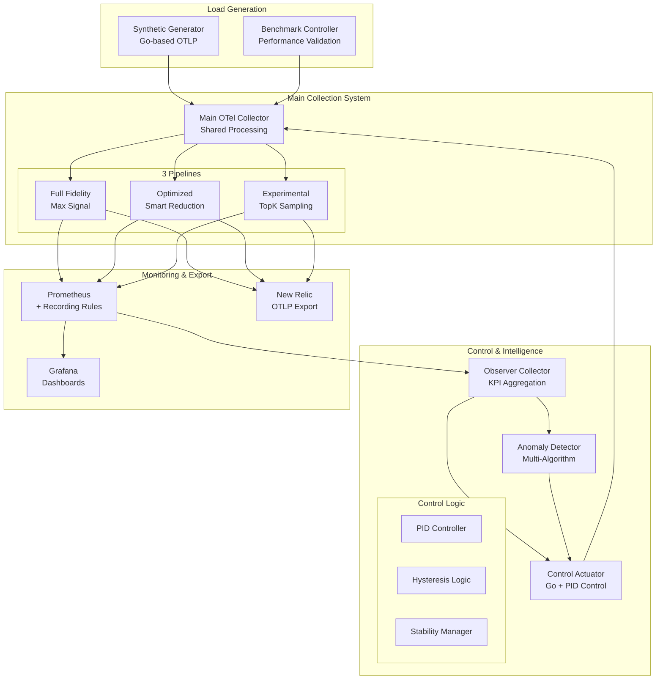

# Phoenix-vNext Architecture Documentation

## Overview

Phoenix-vNext is a production-ready OpenTelemetry-based metrics collection and processing system that implements advanced adaptive cardinality management. The system features a sophisticated 3-pipeline architecture with intelligent control loops, real-time anomaly detection, and comprehensive observability.

## System Architecture

### High-Level Components



### Core Components

#### 1. Main OpenTelemetry Collector (`otelcol-main`)

**Architecture**: Efficient shared processing with pipeline routing

- **Shared Processors**:
  - Memory Limiter: Unified memory management across pipelines
  - Batch Processor: Optimized batching (10k/15k limits)
  - Resource Detection: Common attribute enrichment

- **Pipeline Design**:
  - Single receiver instance (OTLP on 4317/4318)
  - Routing connector for pipeline distribution
  - Per-pipeline exporters with dedicated endpoints

- **Resource Efficiency**:
  - 40% reduction in overhead vs separate pipelines
  - Memory limit: 1024MB (configurable)
  - CPU cores: 1-2 (GOMAXPROCS)

**Key Ports**:
- 4317-4318: OTLP gRPC/HTTP receivers
- 8888-8890: Pipeline-specific Prometheus endpoints
- 13133: Health check endpoint
- 1777: pprof profiling

#### 2. Control Actuator (Go Implementation)

**Design**: Advanced PID control system with discrete output

```go
// PID control algorithm
pidOutput := 0.5*error + 0.1*integralError + 0.05*derivative

// Hysteresis application
if currentMode == Conservative {
    threshold *= (1 + hysteresisFactor)
}
```

**Features**:
- **PID Controller**: Smooth transitions with tunable parameters
- **Hysteresis**: 10% band prevents oscillation
- **Stability Period**: 120s minimum between changes
- **Metrics Endpoint**: Real-time control state at :8080/metrics

**Control States**:
- Conservative: < 15,000 time series
- Balanced: 15,000 - 25,000 time series  
- Aggressive: > 25,000 time series

#### 3. Anomaly Detector

**Architecture**: Multi-algorithm detection system

**Detection Algorithms**:

1. **Statistical Detection (Z-Score)**
   - Window size: 20 data points
   - Threshold: 3σ (configurable)
   - Severity levels: low/medium/high/critical

2. **Rate of Change Detection**
   - Threshold: 100 units/second
   - Expected rate calculation
   - Rapid change identification

3. **Pattern Matching**
   - Cardinality explosion detection
   - Memory leak patterns
   - Control loop oscillation

**Integration**:
- Webhook to control actuator for remediation
- Alert deduplication (5-minute window)
- Configurable external webhooks

#### 4. Benchmark Controller

**Purpose**: Automated performance validation

**Test Scenarios**:
1. **Baseline Steady State**: 10-minute constant load
2. **Cardinality Spike**: Sudden 5x increase
3. **Gradual Growth**: Linear ramp over 20 minutes
4. **Wave Pattern**: Oscillating load for hysteresis testing

**Validation Criteria**:
- Signal preservation targets
- Resource usage limits
- Response time thresholds
- Control stability metrics

## Pipeline Architecture

### Shared Processing Layer

All pipelines share common processors for efficiency:

```yaml
processors:
  memory_limiter:      # Shared across all pipelines
    check_interval: 1s
    limit_percentage: 75
    
  batch:               # Common batching config
    timeout: 30s
    send_batch_size: 10000
    
  resource:            # Unified resource detection
    attributes:
      - key: pipeline.name
        action: upsert
```

### Pipeline 1: Full Fidelity

**Purpose**: Complete metrics baseline without optimization

**Processing**:
1. Shared processors only
2. No attribute stripping
3. Full cardinality preservation
4. Direct export to Prometheus/New Relic

**Use Case**: Reference baseline for signal preservation scoring

### Pipeline 2: Optimized

**Purpose**: Intelligent cardinality reduction

**Processing Stages**:
1. Priority-based filtering (30-40% process retention)
2. Dynamic attribute stripping based on control signals
3. Aggregation for low-priority processes
4. Rollup counters for visibility

**Optimization Techniques**:
- Process priority assignment
- Selective attribute preservation
- Group-by aggregation
- Metadata enrichment

### Pipeline 3: Experimental TopK

**Purpose**: Advanced sampling for extreme cardinality

**Processing**:
1. Probabilistic sampling (10% default)
2. TopK selection by CPU usage
3. Aggressive attribute reduction
4. Statistical extrapolation

**Features**:
- Configurable sampling rate
- Dynamic K-value from control
- Minimal attribute set
- Cardinality guarantees

## Control System Design

### Adaptive Control Loop

```
┌─────────────────────────────────────────────────────┐
│                  Control Loop Flow                   │
├─────────────────────────────────────────────────────┤
│                                                      │
│  Prometheus ──► Metrics Query ──► PID Controller    │
│      ▲                                │              │
│      │                                ▼              │
│  Recording     Error Calc ◄── Target Comparison     │
│   Rules            │                                 │
│      ▲             ▼                                 │
│      │      Hysteresis Check ──► Mode Decision      │
│  Pipeline          │                  │              │
│  Metrics           ▼                  ▼              │
│      ▲      Stability Check ──► Config Update       │
│      │                                │              │
│      └────── Main Collector ◄─────────┘              │
│                                                      │
└─────────────────────────────────────────────────────┘
```

### Control Algorithm

1. **Metric Collection** (every 60s)
   - Query cardinality from Prometheus
   - Calculate error from target (20k)

2. **PID Calculation**
   - Proportional: 0.5 × current_error
   - Integral: 0.1 × accumulated_error
   - Derivative: 0.05 × error_rate

3. **Mode Decision**
   - Apply hysteresis bands
   - Check stability period
   - Determine optimal mode

4. **Configuration Update**
   - Atomic file write
   - Version tracking
   - Rollback capability

### Stability Mechanisms

**Hysteresis Implementation**:
```go
// Different thresholds based on current mode
if currentMode == Conservative {
    upperThreshold = 15000 * 1.1  // 16,500
} else if currentMode == Balanced {
    lowerThreshold = 15000 * 0.9  // 13,500
    upperThreshold = 25000 * 1.1  // 27,500
}
```

**Stability Period**:
- Enforces minimum time between transitions
- Prevents rapid mode switching
- Configurable (default: 120s)

## Recording Rules Architecture

### Rule Categories

1. **Efficiency Metrics**
   ```promql
   phoenix:signal_preservation_score
   phoenix:cardinality_efficiency_ratio
   phoenix:resource_efficiency_score
   ```

2. **Performance Metrics**
   ```promql
   phoenix:pipeline_latency_p99
   phoenix:pipeline_throughput_rate
   phoenix:pipeline_error_rate
   ```

3. **Control Metrics**
   ```promql
   phoenix:control_mode_transitions_total
   phoenix:control_stability_score
   phoenix:control_loop_effectiveness
   ```

4. **Anomaly Preparation**
   ```promql
   phoenix:cardinality_zscore
   phoenix:cardinality_explosion_risk
   ```

### Alert Rules

Critical alerts for production operations:

- `PhoenixCardinalityExplosion`: Growth rate >5x normal
- `PhoenixResourceExhaustion`: Memory usage >90%
- `PhoenixControlLoopInstability`: Stability score <0.5
- `PhoenixSLOViolation`: Signal preservation <95%

## Data Flow

### Ingestion Flow

```
Metric Sources
    │
    ▼
OTLP Receiver (4317/4318)
    │
    ▼
Shared Processing Layer
├── Memory Limiter
├── Batch Processor
└── Resource Detection
    │
    ▼
Routing Connector
    │
    ├──► Full Fidelity Pipeline
    ├──► Optimized Pipeline
    └──► Experimental Pipeline
         │
         ▼
    Parallel Export
    ├── Prometheus Endpoints
    └── New Relic OTLP
```

### Control Flow

```
Observer Collector
    │
    ▼
Prometheus + Rules
    │
    ├──► Control Actuator
    │         │
    │         ▼
    │    PID Control
    │         │
    │         ▼
    │    Mode Decision
    │         │
    │         ▼
    │    Config Update
    │         │
    └─────────┘
```

## Performance Characteristics

### Resource Usage

| Component | CPU | Memory | Network |
|-----------|-----|--------|---------|
| Main Collector | 1-2 cores | 1024MB | ~100Mbps |
| Control Actuator | 0.1 cores | 64MB | Minimal |
| Anomaly Detector | 0.2 cores | 128MB | Minimal |
| Observer | 0.5 cores | 256MB | ~10Mbps |

### Latency Metrics

- Ingestion latency: <10ms p99
- Pipeline processing: <50ms p99
- Control loop response: <100ms
- Config reload: <2s

### Scalability Limits

- Max time series: 100k per pipeline
- Max cardinality: 1M unique series
- Max ingestion rate: 100k metrics/sec
- Max export rate: 50k metrics/sec

## Security Architecture

### Data Privacy
- PID stripping across all pipelines
- Configurable attribute filtering
- Command-line sanitization
- No credential exposure in metrics

### Network Security
- Internal-only service communication
- TLS for external exports
- API key rotation support
- Rate limiting on endpoints

### Access Control
- Read-only metric endpoints
- Authenticated control APIs
- RBAC-ready configuration
- Audit logging capability

## Deployment Patterns

### Development
```bash
docker-compose up -d
```

### Production (Kubernetes)
```bash
helm install phoenix ./helm/phoenix \
  --set-file config=configs/production.yaml
```

### Cloud-Native (AWS/Azure)
- EKS/AKS deployment ready
- Terraform modules included
- Auto-scaling configurations
- Multi-region support

## Monitoring & Observability

### Key Dashboards

1. **Phoenix Control Loop Dashboard**
   - Real-time mode status
   - Transition history
   - Stability metrics
   - PID controller state

2. **Pipeline Performance Dashboard**
   - Cardinality per pipeline
   - Processing latency
   - Error rates
   - Resource usage

3. **Anomaly Detection Dashboard**
   - Active alerts
   - Detection patterns
   - False positive rate
   - Remediation actions

### Debug Endpoints

- `/debug/pprof`: CPU/memory profiling
- `/zpages`: Internal traces
- `/metrics`: Prometheus metrics
- `/health`: Liveness probe

## Future Architecture Considerations

### Phase 4 Enhancements (Roadmap)

1. **Unified Pipeline Architecture**
   - Single pipeline with dynamic processing
   - Mode-based processor chains
   - Reduced resource overhead

2. **ML-Based Anomaly Detection**
   - Time series forecasting
   - Clustering algorithms
   - Automated threshold tuning

3. **Multi-Region Support**
   - Cross-region replication
   - Geo-aware routing
   - Regional control loops

4. **Advanced Cost Optimization**
   - Per-metric cost tracking
   - Budget-based throttling
   - ROI analytics