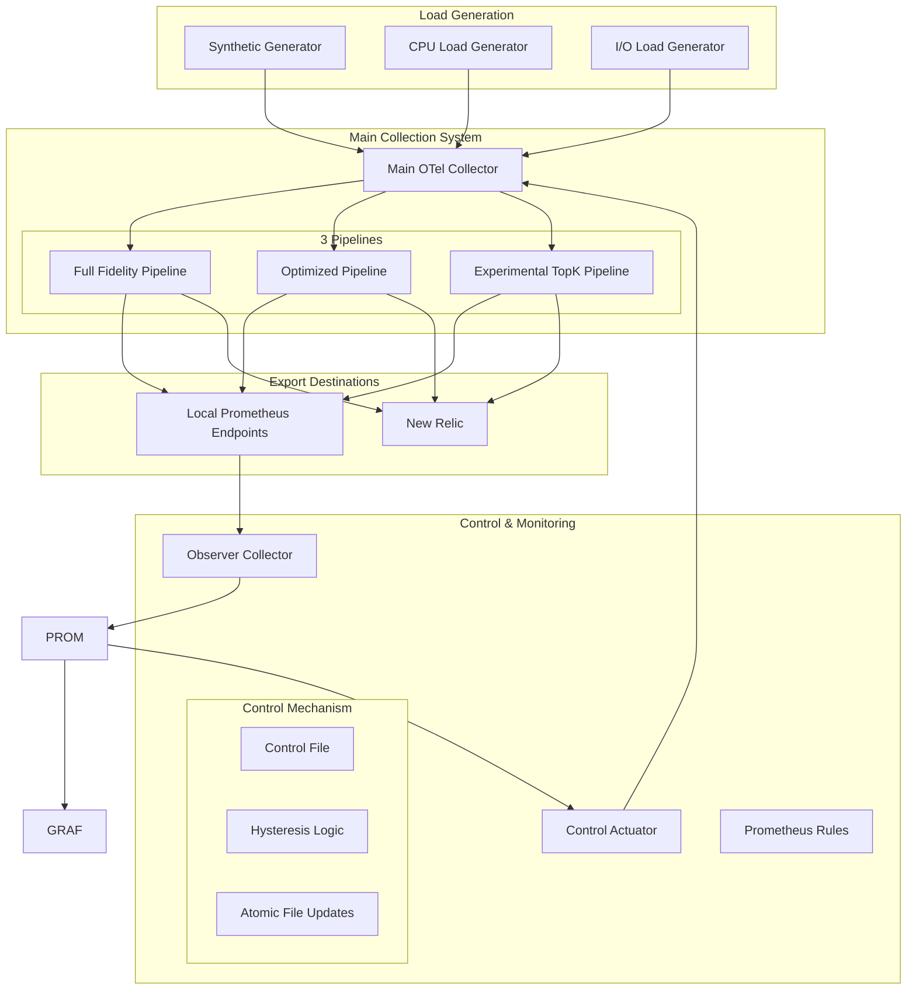

# Phoenix-vNext Architecture Documentation

## Overview

Phoenix-vNext is a sophisticated OpenTelemetry-based metrics collection and processing system designed to demonstrate and benchmark adaptive cardinality management strategies. The system implements a 3-pipeline architecture that processes metrics through different optimization levels while maintaining a dynamic control loop for automatic adaptation.

## System Architecture

### High-Level Components



### Core Components

#### 1. Main OpenTelemetry Collector (`otelcol-main`)

The heart of the system, implementing three parallel processing pipelines:

- **Resource Limits**: 1 CPU core, 1GB RAM
- **Ports**: 
  - 4318: OTLP/HTTP ingest
  - 8888-8890: Prometheus endpoints for each pipeline
  - 13133: Health check
  - 1777: pprof profiling
  - 55679: zpages

**Key Features**:
- Dynamic configuration reloading via file watchers
- Shared hostmetrics collection with process focus
- Per-pipeline cardinality estimation
- Configurable memory ballast and limits

#### 2. Observer Collector (`otelcol-observer`)

Control plane component responsible for:
- Scraping metrics from main collector's three endpoints
- Calculating cardinality estimates and system KPIs
- Providing aggregated metrics to Prometheus for control decisions

**Resource Limits**: 1 CPU core, 256MB RAM

#### 3. Control Loop Actuator (`control-loop-actuator`)

Bash-based PID-like controller that:
- Queries cardinality metrics from Prometheus
- Implements hysteresis to prevent oscillation
- Updates optimization profile based on thresholds
- Writes control signals to shared configuration files

**Configuration**:
- Conservative: < 15,000 time series
- Balanced: 15,000 - 25,000 time series
- Aggressive: > 25,000 time series

#### 4. Synthetic Metrics Generator (`synthetic-metrics-generator`)

Go application generating realistic process metrics:
- Configurable number of processes and hosts
- Simulates memory leaks, CPU spikes, process restarts
- Uses OpenTelemetry semantic conventions
- Sends data via OTLP/HTTP to main collector

## Pipeline Architecture

### Pipeline 1: Full Fidelity

**Purpose**: Baseline metrics collection with minimal processing

**Processing Steps**:
1. Resource tagging (`phoenix.pipeline.strategy: "full_fidelity"`)
2. Basic PID stripping for privacy
3. Cardinality estimation
4. Batching and export

**Cardinality Impact**: Preserves all attributes and dimensions

### Pipeline 2: Optimized

**Purpose**: Moderate cardinality reduction through selective filtering and aggregation

**Processing Steps**:
1. Priority-based filtering (keeps 30-40% of processes)
2. Selective attribute dropping based on priority
3. Rollup aggregation for low-priority processes
4. Dynamic attribute list from control signals
5. Cardinality estimation

**Optimization Techniques**:
- Process priority filtering
- Attribute stripping for non-critical processes
- Grouping and aggregation by executable name
- Rollup counters for dropped processes

### Pipeline 3: Experimental TopK

**Purpose**: Advanced cardinality reduction using TopK sampling

**Processing Steps**:
1. TopK processor (SpaceSaving algorithm)
2. Aggressive attribute stripping
3. Rollup for non-TopK processes
4. Minimal attribute preservation

**Features**:
- Dynamic K-value from control signals
- CPU-time based ranking
- Most aggressive cardinality reduction
- Experimental processor usage

## Control System

### Adaptive Profile Switching

The control system implements a feedback loop:

1. **Metric Collection**: Observer scrapes pipeline outputs
2. **Aggregation**: Cardinality estimates calculated per pipeline
3. **Decision Logic**: Control actuator compares against thresholds
4. **Profile Update**: Optimization mode written to control file
5. **Configuration Reload**: Main collector reloads and adjusts behavior

### Hysteresis Implementation

To prevent rapid switching between profiles:
- Different thresholds for upward vs downward transitions
- Configurable transition delays
- State persistence between actuator restarts

### Control Signals

Dynamic configuration via `configs/control/optimization_mode.yaml`:

```yaml
current_mode: "balanced"
pipeline_enables:
  full_fidelity: true
  optimized: true
  experimental_topk: false
advanced_phoenix_parameters:
  target_k_value_for_experimental_topk: 15
  optimised_pipeline_keep_attributes:
    - "host.name"
    - "service.name"
    - "process.executable.name"
    - "phoenix.priority"
```

## Data Flow

### Ingestion Flow

1. **Hostmetrics**: Main collector scrapes host process metrics every 15s
2. **Synthetic Data**: Go generator sends OTLP metrics to port 4318
3. **Common Processing**: All metrics undergo initial enrichment
4. **Fan-out**: Routing connector replicates data to all three pipelines

### Processing Flow

Each pipeline processes the same input data differently:

```
Input Metrics 
    ↓
Common Intake (priority assignment, basic cleanup)
    ↓
Routing Connector (fan-out to 3 pipelines)
    ↓
┌─────────────┬─────────────┬─────────────┐
│   Full      │ Optimized   │Experimental │
│ Fidelity    │ Pipeline    │    TopK     │
└─────────────┴─────────────┴─────────────┘
    ↓             ↓             ↓
Local Prometheus Endpoints (8888-8890)
    ↓             ↓             ↓
New Relic Export (separate API keys)
```

### Export Flow

- **Local Monitoring**: Each pipeline exports to separate Prometheus endpoints
- **External Export**: Distinct New Relic API keys for each pipeline
- **Observability**: Debug logging with sampling for troubleshooting

## Resource Management

### Memory Management

- **Ballast Extension**: Pre-allocated memory to reduce GC pressure
- **Memory Limiter**: Per-pipeline memory limits with backpressure
- **Batch Processing**: Configurable batch sizes to optimize throughput

### CPU Management

- **GOMAXPROCS**: Limited to prevent resource contention
- **Process Priorities**: Priority-based scheduling in optimized pipeline
- **Cardinality Budgets**: Dynamic limits based on system capacity

## Monitoring & Observability

### Key Metrics

- `phoenix_pipeline_output_cardinality_estimate`: Per-pipeline cardinality
- `otelcol_processor_batch_batch_send_size`: Batch processing metrics
- `process_memory_usage`: System resource consumption
- `phoenix_control_profile_switches_total`: Control system activity

### Health Checks

- Collector health endpoints on ports 13133-13134
- Service dependency checks in docker-compose
- Prometheus targets monitoring for service discovery

### Debugging

- **pprof**: CPU and memory profiling on ports 1777-1778
- **zpages**: Internal collector state on ports 55679-55680
- **Debug Logging**: Structured JSON logs with sampling

## Security Considerations

### Data Privacy

- Automatic PID stripping across all pipelines
- Configurable attribute filtering
- Command-line sanitization for sensitive processes

### Network Security

- Internal-only communication between services
- External exports only to configured endpoints
- Health check endpoints exposed for monitoring

### Resource Isolation

- Container-based isolation with resource limits
- Separate data volumes for each service
- Non-root user execution where possible

## Scalability & Performance

### Horizontal Scaling

- Independent pipeline scaling
- Configurable batch sizes and timeouts
- Queue-based backpressure handling

### Vertical Scaling

- Adjustable resource limits via environment variables
- Memory ballast tuning for GC optimization
- CPU affinity configuration for NUMA systems

### Performance Optimization

- Efficient attribute processing with keep_keys operations
- Cardinality-aware processing decisions
- Streaming cardinality estimation to avoid buffering

## Configuration Management

### Environment Variables

Key configuration via `.env` file:
- Resource limits and scaling parameters
- Threshold values for control decisions
- Export destinations and API keys
- Feature flags for pipeline enables

### Dynamic Configuration

- File-based control signals with hot-reload
- Template-based configuration generation
- Validation and rollback mechanisms

### Deployment Patterns

- Docker Compose for development and testing
- Kubernetes-ready configuration structure
- Environment-specific overrides support

## Control System Design

### Adaptive Control Loop

The Phoenix-vNext control system implements a robust adaptive control loop with the following features:

#### Reliable State Management
- **Atomic File Updates**: All configuration changes are made using atomic file writes to prevent corrupted configurations.
- **Locking Mechanism**: Proper file locking prevents race conditions between multiple writers.
- **Error Recovery**: The control actuator implements retry mechanisms and fallbacks for resilience.

#### Control Loop Stability 
- **Hysteresis**: The control system implements a configurable hysteresis factor (default 10%) to prevent oscillation when metrics are near thresholds.
- **Stability Period**: A configurable time window required between profile changes prevents rapid oscillation.
- **Profile-Aware Transitions**: Different thresholds are used depending on the current profile to create a "sticky" state effect.

#### Monitoring and Alerting
- **Comprehensive Prometheus Rules**: Recording rules for key performance indicators and alerting rules for system health.
- **Pipeline Health Metrics**: Dedicated metrics for monitoring the health of each pipeline.
- **Configuration Validation**: Validation of generated configuration before applying changes.

### Error Handling and Resilience

The system incorporates multiple layers of error handling:

1. **Prometheus Query Resilience**:
   - Configurable retry mechanism for transient errors
   - Default values for unavailable metrics
   - Validation of query results

2. **Resource Management**:
   - Memory limit detection and enforcement
   - Garbage collection triggers for high memory scenarios
   - Resource usage monitoring for early detection of issues

3. **Graceful Shutdown**:
   - Proper signal handling for clean termination
   - Resource cleanup procedures
   - In-progress operation completion

## Testing Strategy

The Phoenix-vNext system includes a comprehensive testing approach:

1. **Unit Testing**:
   - Mock-based tests for the control actuator
   - Isolation testing of key components

2. **Integration Testing**:
   - Docker-based testing for full system interaction
   - Simulated metric load tests

3. **Performance Testing**:
   - Cardinality benchmarking
   - Load testing with synthetic generator

## Operational Considerations

Refer to the TROUBLESHOOTING.md document for detailed operational runbooks and issue resolution procedures.