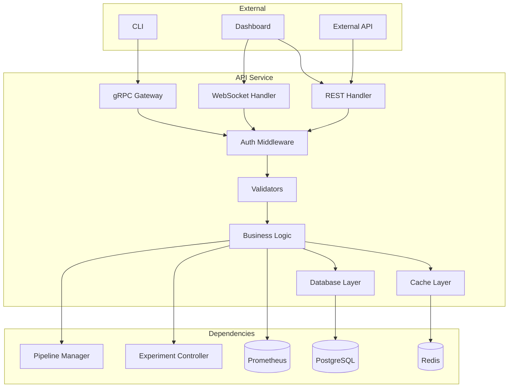

# Phoenix API Service - Technical Specification

**Document ID:** PHX-TECH-API-001  
**Version:** 1.0.0  
**Service:** phoenix-api  
**Status:** Authoritative  
**Parent Spec:** [TECHNICAL_SPEC_MASTER.md](./TECHNICAL_SPEC_MASTER.md)

## Table of Contents

1. [Service Overview](#1-service-overview)
2. [Architecture](#2-architecture)
3. [API Specifications](#3-api-specifications)
4. [Data Models](#4-data-models)
5. [Service Dependencies](#5-service-dependencies)
6. [Security Implementation](#6-security-implementation)
7. [Performance Specifications](#7-performance-specifications)
8. [Configuration Management](#8-configuration-management)
9. [Monitoring & Observability](#9-monitoring--observability)
10. [Testing Requirements](#10-testing-requirements)
11. [Deployment Specifications](#11-deployment-specifications)
12. [Service-Specific Standards](#12-service-specific-standards)

## 1. Service Overview

### 1.1 Purpose

The Phoenix API Service is the central gateway for all client interactions with the Phoenix platform. It provides both gRPC and REST APIs for experiment management, pipeline deployment, and metrics visualization.

### 1.2 Key Responsibilities

- **Authentication & Authorization**: JWT validation, RBAC enforcement
- **Experiment Management**: CRUD operations for experiments
- **Pipeline Operations**: Deploy, validate, and manage OTel pipelines
- **Metrics Aggregation**: Query and aggregate metrics from Prometheus
- **WebSocket Support**: Real-time updates for experiments and metrics
- **API Gateway**: Route requests to appropriate backend services

### 1.3 Service Boundaries

```yaml
service_boundaries:
  inbound:
    - phoenix-cli: gRPC/REST API calls
    - phoenix-dashboard: REST/WebSocket connections
    - external-apis: REST API with authentication
    
  outbound:
    - postgres: Experiment persistence
    - redis: Caching and session storage
    - prometheus: Metrics queries
    - experiment-controller: Experiment operations
    - pipeline-manager: Pipeline operations
```

## 2. Architecture

### 2.1 Component Architecture



### 2.2 Request Flow

```yaml
request_flow:
  grpc:
    1_receive: gRPC server receives request
    2_auth: JWT validation in interceptor
    3_validate: Request validation
    4_business: Business logic execution
    5_persist: Database operations if needed
    6_cache: Update cache if applicable
    7_response: Return gRPC response
    
  rest:
    1_receive: HTTP server receives request
    2_auth: JWT validation in middleware
    3_parse: Parse and validate JSON
    4_convert: Convert to internal types
    5_business: Business logic execution
    6_response: Return JSON response
    
  websocket:
    1_upgrade: HTTP connection upgrade
    2_auth: Validate auth token
    3_subscribe: Subscribe to event streams
    4_stream: Stream updates to client
    5_heartbeat: Maintain connection health
```

## 3. API Specifications

### 3.1 gRPC Services

```protobuf
syntax = "proto3";
package phoenix.api.v1;

import "google/api/annotations.proto";
import "google/protobuf/timestamp.proto";
import "google/protobuf/duration.proto";
import "google/protobuf/empty.proto";
import "validate/validate.proto";

// ExperimentService provides experiment management operations
service ExperimentService {
  // Creates a new experiment
  rpc CreateExperiment(CreateExperimentRequest) returns (Experiment) {
    option (google.api.http) = {
      post: "/v1/experiments"
      body: "experiment"
    };
  }
  
  // Gets an experiment by ID
  rpc GetExperiment(GetExperimentRequest) returns (Experiment) {
    option (google.api.http) = {
      get: "/v1/experiments/{experiment_id}"
    };
  }
  
  // Lists experiments with filtering and pagination
  rpc ListExperiments(ListExperimentsRequest) returns (ListExperimentsResponse) {
    option (google.api.http) = {
      get: "/v1/experiments"
    };
  }
  
  // Updates an experiment
  rpc UpdateExperiment(UpdateExperimentRequest) returns (Experiment) {
    option (google.api.http) = {
      patch: "/v1/experiments/{experiment_id}"
      body: "experiment"
    };
  }
  
  // Deletes an experiment
  rpc DeleteExperiment(DeleteExperimentRequest) returns (google.protobuf.Empty) {
    option (google.api.http) = {
      delete: "/v1/experiments/{experiment_id}"
    };
  }
  
  // Starts an experiment
  rpc StartExperiment(StartExperimentRequest) returns (Experiment) {
    option (google.api.http) = {
      post: "/v1/experiments/{experiment_id}:start"
    };
  }
  
  // Stops an experiment
  rpc StopExperiment(StopExperimentRequest) returns (Experiment) {
    option (google.api.http) = {
      post: "/v1/experiments/{experiment_id}:stop"
    };
  }
  
  // Promotes an experiment variant
  rpc PromoteVariant(PromoteVariantRequest) returns (Experiment) {
    option (google.api.http) = {
      post: "/v1/experiments/{experiment_id}:promote"
      body: "*"
    };
  }
  
  // Streams real-time experiment updates
  rpc StreamExperimentUpdates(StreamExperimentUpdatesRequest) returns (stream ExperimentUpdate);
}

// PipelineService manages pipeline configurations
service PipelineService {
  // Lists available pipeline templates
  rpc ListPipelineTemplates(ListPipelineTemplatesRequest) returns (ListPipelineTemplatesResponse) {
    option (google.api.http) = {
      get: "/v1/pipelines/templates"
    };
  }
  
  // Validates a pipeline configuration
  rpc ValidatePipeline(ValidatePipelineRequest) returns (ValidatePipelineResponse) {
    option (google.api.http) = {
      post: "/v1/pipelines:validate"
      body: "pipeline"
    };
  }
  
  // Deploys a pipeline to target hosts
  rpc DeployPipeline(DeployPipelineRequest) returns (DeployPipelineResponse) {
    option (google.api.http) = {
      post: "/v1/pipelines:deploy"
      body: "*"
    };
  }
  
  // Gets pipeline deployment status
  rpc GetPipelineStatus(GetPipelineStatusRequest) returns (PipelineStatus) {
    option (google.api.http) = {
      get: "/v1/pipelines/{deployment_id}/status"
    };
  }
}

// MetricsService provides access to platform metrics
service MetricsService {
  // Queries metrics using PromQL
  rpc QueryMetrics(QueryMetricsRequest) returns (QueryMetricsResponse) {
    option (google.api.http) = {
      post: "/v1/metrics:query"
      body: "*"
    };
  }
  
  // Gets cost analysis for experiments
  rpc GetCostAnalysis(GetCostAnalysisRequest) returns (CostAnalysis) {
    option (google.api.http) = {
      get: "/v1/metrics/cost/{experiment_id}"
    };
  }
}
```

### 3.2 REST API Endpoints

```yaml
rest_endpoints:
  # Authentication
  - path: /v1/auth/login
    method: POST
    auth: none
    body:
      username: string
      password: string
    response:
      access_token: string
      refresh_token: string
      expires_in: int
      
  - path: /v1/auth/refresh
    method: POST
    auth: refresh_token
    response:
      access_token: string
      expires_in: int
      
  # User Management  
  - path: /v1/users/me
    method: GET
    auth: bearer
    response:
      id: string
      email: string
      roles: string[]
      
  # Health Checks
  - path: /health
    method: GET
    auth: none
    response:
      status: healthy|unhealthy
      version: string
      
  - path: /ready
    method: GET
    auth: none
    response:
      ready: boolean
      dependencies:
        postgres: boolean
        redis: boolean
        prometheus: boolean
```

### 3.3 WebSocket Events

```typescript
// WebSocket connection establishment
interface ConnectionRequest {
  token: string;
  subscriptions: Subscription[];
}

interface Subscription {
  type: 'experiment' | 'metrics' | 'system';
  filters?: Record<string, any>;
}

// Event types
enum EventType {
  // Connection events
  CONNECTION_ACK = 'connection.ack',
  CONNECTION_ERROR = 'connection.error',
  
  // Subscription events
  SUBSCRIPTION_CONFIRMED = 'subscription.confirmed',
  SUBSCRIPTION_ERROR = 'subscription.error',
  
  // Data events
  EXPERIMENT_UPDATE = 'experiment.update',
  METRICS_UPDATE = 'metrics.update',
  COST_UPDATE = 'cost.update',
  PIPELINE_UPDATE = 'pipeline.update',
  
  // System events
  MAINTENANCE_NOTICE = 'system.maintenance',
  SERVICE_DEGRADATION = 'system.degradation'
}

// Event payload structure
interface WebSocketEvent<T = any> {
  id: string;
  type: EventType;
  timestamp: string;
  subscription_id?: string;
  data: T;
  metadata?: {
    source?: string;
    correlation_id?: string;
    [key: string]: any;
  };
}
```

## 4. Data Models

### 4.1 Internal Data Structures

```go
// internal/api/models/experiment.go
package models

import (
    "time"
    "github.com/google/uuid"
    "github.com/lib/pq"
)

// Experiment represents a complete experiment configuration
type Experiment struct {
    ID          uuid.UUID           `json:"id" db:"id"`
    Name        string              `json:"name" db:"name" validate:"required,min=3,max=255"`
    Description string              `json:"description" db:"description"`
    OwnerID     uuid.UUID           `json:"owner_id" db:"owner_id"`
    Status      ExperimentStatus    `json:"status" db:"status"`
    Spec        ExperimentSpec      `json:"spec" db:"spec"`
    Results     *ExperimentResults  `json:"results,omitempty" db:"results"`
    CreatedAt   time.Time           `json:"created_at" db:"created_at"`
    UpdatedAt   time.Time           `json:"updated_at" db:"updated_at"`
    StartedAt   *time.Time          `json:"started_at,omitempty" db:"started_at"`
    CompletedAt *time.Time          `json:"completed_at,omitempty" db:"completed_at"`
    
    // Computed fields
    Duration    *time.Duration      `json:"duration,omitempty" db:"-"`
    CostSavings *float64            `json:"cost_savings,omitempty" db:"-"`
}

type ExperimentStatus string

const (
    ExperimentStatusPending    ExperimentStatus = "pending"
    ExperimentStatusGenerating ExperimentStatus = "generating"
    ExperimentStatusDeploying  ExperimentStatus = "deploying"
    ExperimentStatusRunning    ExperimentStatus = "running"
    ExperimentStatusAnalyzing  ExperimentStatus = "analyzing"
    ExperimentStatusCompleted  ExperimentStatus = "completed"
    ExperimentStatusFailed     ExperimentStatus = "failed"
    ExperimentStatusCancelled  ExperimentStatus = "cancelled"
)

type ExperimentSpec struct {
    TargetHost       string              `json:"target_host" validate:"required"`
    Duration         Duration            `json:"duration" validate:"required"`
    Variants         []PipelineVariant   `json:"variants" validate:"required,len=2"`
    LoadProfile      LoadProfile         `json:"load_profile" validate:"required"`
    CriticalProcesses pq.StringArray     `json:"critical_processes" db:"critical_processes"`
    SuccessCriteria  SuccessCriteria     `json:"success_criteria" validate:"required"`
}

type PipelineVariant struct {
    Name        string              `json:"name" validate:"required,oneof=baseline candidate"`
    Pipeline    string              `json:"pipeline" validate:"required"`
    Description string              `json:"description"`
    Config      map[string]any      `json:"config,omitempty"`
}

type LoadProfile struct {
    Type       string              `json:"type" validate:"required,oneof=realistic high-cardinality high-churn custom"`
    Parameters map[string]any      `json:"parameters,omitempty"`
}

type SuccessCriteria struct {
    MinCardinalityReduction float64 `json:"min_cardinality_reduction" validate:"min=0,max=1"`
    MaxCriticalProcessLoss  float64 `json:"max_critical_process_loss" validate:"min=0,max=1"`
    MaxLatencyIncrease      float64 `json:"max_latency_increase" validate:"min=0"`
    MinCostReduction        float64 `json:"min_cost_reduction" validate:"min=0,max=1"`
}

type ExperimentResults struct {
    Summary         ResultSummary              `json:"summary"`
    VariantResults  map[string]VariantResult   `json:"variant_results"`
    Recommendation  string                     `json:"recommendation"`
    AnalysisDetails map[string]any             `json:"analysis_details"`
}
```

### 4.2 Database Schema

```sql
-- Experiments table with JSONB for flexible spec storage
CREATE TABLE experiments (
    id UUID PRIMARY KEY DEFAULT gen_random_uuid(),
    name VARCHAR(255) NOT NULL,
    description TEXT,
    owner_id UUID NOT NULL REFERENCES users(id),
    status VARCHAR(50) NOT NULL DEFAULT 'pending',
    spec JSONB NOT NULL,
    results JSONB,
    created_at TIMESTAMPTZ NOT NULL DEFAULT NOW(),
    updated_at TIMESTAMPTZ NOT NULL DEFAULT NOW(),
    started_at TIMESTAMPTZ,
    completed_at TIMESTAMPTZ,
    
    -- Indexes for common queries
    INDEX idx_experiments_owner_id (owner_id),
    INDEX idx_experiments_status (status),
    INDEX idx_experiments_created_at (created_at DESC),
    INDEX idx_experiments_name_gin (name gin_trgm_ops), -- For text search
    
    -- Constraints
    CONSTRAINT chk_status CHECK (status IN ('pending', 'generating', 'deploying', 'running', 'analyzing', 'completed', 'failed', 'cancelled')),
    CONSTRAINT chk_dates CHECK (started_at IS NULL OR started_at >= created_at),
    CONSTRAINT chk_completed CHECK (completed_at IS NULL OR completed_at >= started_at)
);

-- Trigger to update updated_at
CREATE OR REPLACE FUNCTION update_updated_at_column()
RETURNS TRIGGER AS $$
BEGIN
    NEW.updated_at = NOW();
    RETURN NEW;
END;
$$ language 'plpgsql';

CREATE TRIGGER update_experiments_updated_at BEFORE UPDATE
    ON experiments FOR EACH ROW EXECUTE FUNCTION update_updated_at_column();

-- Audit log for experiments
CREATE TABLE experiment_audit_log (
    id BIGSERIAL PRIMARY KEY,
    experiment_id UUID NOT NULL REFERENCES experiments(id) ON DELETE CASCADE,
    action VARCHAR(50) NOT NULL,
    actor_id UUID REFERENCES users(id),
    changes JSONB,
    created_at TIMESTAMPTZ NOT NULL DEFAULT NOW(),
    
    -- Partitioned by month for efficient cleanup
    -- Partition key must be part of primary key
    partition_key INT GENERATED ALWAYS AS (EXTRACT(YEAR FROM created_at) * 100 + EXTRACT(MONTH FROM created_at)) STORED
) PARTITION BY RANGE (partition_key);

-- Create initial partitions
CREATE TABLE experiment_audit_log_2024_05 PARTITION OF experiment_audit_log
    FOR VALUES FROM (202405) TO (202406);
```

### 4.3 Cache Schema

```yaml
redis_schema:
  # User sessions
  session:{user_id}:
    type: hash
    ttl: 7d
    fields:
      user_id: uuid
      email: string
      roles: json_array
      created_at: timestamp
      
  # Experiment cache
  experiment:{id}:
    type: string
    ttl: 5m
    value: json_encoded_experiment
    
  # Pipeline templates cache
  pipeline_templates:
    type: string
    ttl: 1h
    value: json_array
    
  # Metrics cache
  metrics:{query_hash}:
    type: string
    ttl: 1m
    value: prometheus_response
    
  # Rate limiting
  rate_limit:{user_id}:{endpoint}:
    type: string
    ttl: 1m
    value: request_count
```

## 5. Service Dependencies

### 5.1 Required Services

```yaml
dependencies:
  critical:
    postgres:
      purpose: Primary data store
      connection:
        host: ${POSTGRES_HOST}
        port: 5432
        database: phoenix
        ssl_mode: require
      health_check:
        query: SELECT 1
        timeout: 5s
        
    redis:
      purpose: Cache and sessions
      connection:
        host: ${REDIS_HOST}
        port: 6379
        db: 0
        password: ${REDIS_PASSWORD}
      health_check:
        command: PING
        timeout: 2s
        
  optional:
    prometheus:
      purpose: Metrics queries
      connection:
        url: ${PROMETHEUS_URL}
      health_check:
        endpoint: /-/healthy
        timeout: 5s
        
    experiment_controller:
      purpose: Experiment operations
      connection:
        endpoint: ${EXPERIMENT_CONTROLLER_ENDPOINT}
        protocol: grpc
      health_check:
        rpc: HealthCheck
        timeout: 5s
```

### 5.2 Service Discovery

```go
// internal/api/discovery/discovery.go
package discovery

import (
    "context"
    "fmt"
    "time"
    
    "google.golang.org/grpc"
    "google.golang.org/grpc/health/grpc_health_v1"
)

type ServiceDiscovery interface {
    GetService(name string) (ServiceEndpoint, error)
    RegisterHealthCheck(name string, check HealthCheck)
    IsHealthy(name string) bool
}

type ServiceEndpoint struct {
    Address  string
    Port     int
    Protocol string
    Metadata map[string]string
}

type HealthCheck func(ctx context.Context) error

// K8sServiceDiscovery uses Kubernetes DNS for service discovery
type K8sServiceDiscovery struct {
    namespace    string
    healthChecks map[string]HealthCheck
    healthStatus map[string]bool
}

func (k *K8sServiceDiscovery) GetService(name string) (ServiceEndpoint, error) {
    // In Kubernetes, services are available at:
    // <service-name>.<namespace>.svc.cluster.local
    return ServiceEndpoint{
        Address:  fmt.Sprintf("%s.%s.svc.cluster.local", name, k.namespace),
        Port:     getDefaultPort(name),
        Protocol: getDefaultProtocol(name),
    }, nil
}
```

## 6. Security Implementation

### 6.1 Authentication

```go
// internal/api/auth/jwt.go
package auth

import (
    "context"
    "errors"
    "time"
    
    "github.com/golang-jwt/jwt/v5"
)

type JWTManager struct {
    privateKey *rsa.PrivateKey
    publicKey  *rsa.PublicKey
    issuer     string
    audience   string
}

type Claims struct {
    jwt.RegisteredClaims
    UserID string   `json:"user_id"`
    Email  string   `json:"email"`
    Roles  []string `json:"roles"`
}

func (m *JWTManager) GenerateToken(user *User) (string, error) {
    now := time.Now()
    claims := Claims{
        RegisteredClaims: jwt.RegisteredClaims{
            Issuer:    m.issuer,
            Subject:   user.ID.String(),
            Audience:  jwt.ClaimStrings{m.audience},
            ExpiresAt: jwt.NewNumericDate(now.Add(1 * time.Hour)),
            NotBefore: jwt.NewNumericDate(now),
            IssuedAt:  jwt.NewNumericDate(now),
            ID:        generateJTI(),
        },
        UserID: user.ID.String(),
        Email:  user.Email,
        Roles:  user.Roles,
    }
    
    token := jwt.NewWithClaims(jwt.SigningMethodRS256, claims)
    return token.SignedString(m.privateKey)
}

func (m *JWTManager) ValidateToken(tokenString string) (*Claims, error) {
    token, err := jwt.ParseWithClaims(tokenString, &Claims{}, func(token *jwt.Token) (interface{}, error) {
        if _, ok := token.Method.(*jwt.SigningMethodRSA); !ok {
            return nil, errors.New("unexpected signing method")
        }
        return m.publicKey, nil
    })
    
    if err != nil {
        return nil, err
    }
    
    if claims, ok := token.Claims.(*Claims); ok && token.Valid {
        return claims, nil
    }
    
    return nil, errors.New("invalid token")
}
```

### 6.2 Authorization

```go
// internal/api/auth/rbac.go
package auth

import (
    "context"
    "fmt"
)

type Permission string

const (
    // Experiment permissions
    PermissionExperimentRead   Permission = "experiment:read"
    PermissionExperimentCreate Permission = "experiment:create"
    PermissionExperimentUpdate Permission = "experiment:update"
    PermissionExperimentDelete Permission = "experiment:delete"
    PermissionExperimentStart  Permission = "experiment:start"
    PermissionExperimentStop   Permission = "experiment:stop"
    
    // Pipeline permissions
    PermissionPipelineRead     Permission = "pipeline:read"
    PermissionPipelineDeploy   Permission = "pipeline:deploy"
    PermissionPipelineValidate Permission = "pipeline:validate"
    
    // Metrics permissions
    PermissionMetricsRead      Permission = "metrics:read"
    PermissionCostRead         Permission = "cost:read"
)

type Role string

const (
    RoleViewer       Role = "viewer"
    RoleOperator     Role = "operator"
    RoleExperimenter Role = "experimenter"
    RoleAdmin        Role = "admin"
)

var rolePermissions = map[Role][]Permission{
    RoleViewer: {
        PermissionExperimentRead,
        PermissionPipelineRead,
        PermissionMetricsRead,
    },
    RoleOperator: {
        PermissionExperimentRead,
        PermissionPipelineRead,
        PermissionPipelineDeploy,
        PermissionPipelineValidate,
        PermissionMetricsRead,
    },
    RoleExperimenter: {
        PermissionExperimentRead,
        PermissionExperimentCreate,
        PermissionExperimentUpdate,
        PermissionExperimentStart,
        PermissionExperimentStop,
        PermissionPipelineRead,
        PermissionPipelineDeploy,
        PermissionMetricsRead,
        PermissionCostRead,
    },
    RoleAdmin: {
        // Admins have all permissions
        PermissionExperimentRead,
        PermissionExperimentCreate,
        PermissionExperimentUpdate,
        PermissionExperimentDelete,
        PermissionExperimentStart,
        PermissionExperimentStop,
        PermissionPipelineRead,
        PermissionPipelineDeploy,
        PermissionPipelineValidate,
        PermissionMetricsRead,
        PermissionCostRead,
    },
}

type Authorizer interface {
    Authorize(ctx context.Context, permission Permission) error
    AuthorizeResource(ctx context.Context, permission Permission, resourceID string) error
}

type RBACAuthorizer struct {
    userRoles map[string][]Role
}

func (a *RBACAuthorizer) Authorize(ctx context.Context, permission Permission) error {
    claims := GetClaimsFromContext(ctx)
    if claims == nil {
        return fmt.Errorf("no claims in context")
    }
    
    for _, role := range claims.Roles {
        if permissions, ok := rolePermissions[Role(role)]; ok {
            for _, p := range permissions {
                if p == permission {
                    return nil
                }
            }
        }
    }
    
    return fmt.Errorf("user lacks permission: %s", permission)
}
```

### 6.3 Rate Limiting

```go
// internal/api/middleware/ratelimit.go
package middleware

import (
    "fmt"
    "net/http"
    "time"
    
    "github.com/go-redis/redis/v8"
)

type RateLimiter struct {
    redis  *redis.Client
    limits map[string]RateLimit
}

type RateLimit struct {
    Requests int
    Window   time.Duration
}

var defaultLimits = map[string]RateLimit{
    "default":     {Requests: 100, Window: time.Minute},
    "auth":        {Requests: 10, Window: time.Minute},
    "experiments": {Requests: 50, Window: time.Minute},
    "metrics":     {Requests: 200, Window: time.Minute},
}

func (r *RateLimiter) Middleware(next http.Handler) http.Handler {
    return http.HandlerFunc(func(w http.ResponseWriter, req *http.Request) {
        userID := getUserIDFromRequest(req)
        endpoint := getEndpointKey(req)
        
        key := fmt.Sprintf("rate_limit:%s:%s", userID, endpoint)
        limit := r.getLimitForEndpoint(endpoint)
        
        // Check current count
        count, err := r.redis.Incr(req.Context(), key).Result()
        if err != nil {
            http.Error(w, "Internal error", http.StatusInternalServerError)
            return
        }
        
        // Set expiry on first request
        if count == 1 {
            r.redis.Expire(req.Context(), key, limit.Window)
        }
        
        // Check if over limit
        if count > int64(limit.Requests) {
            w.Header().Set("X-RateLimit-Limit", fmt.Sprintf("%d", limit.Requests))
            w.Header().Set("X-RateLimit-Remaining", "0")
            w.Header().Set("X-RateLimit-Reset", fmt.Sprintf("%d", time.Now().Add(limit.Window).Unix()))
            http.Error(w, "Rate limit exceeded", http.StatusTooManyRequests)
            return
        }
        
        // Add rate limit headers
        w.Header().Set("X-RateLimit-Limit", fmt.Sprintf("%d", limit.Requests))
        w.Header().Set("X-RateLimit-Remaining", fmt.Sprintf("%d", limit.Requests-int(count)))
        
        next.ServeHTTP(w, req)
    })
}
```

## 7. Performance Specifications

### 7.1 Performance Requirements

```yaml
performance_requirements:
  latency:
    p50: 20ms
    p95: 50ms
    p99: 100ms
    max: 1000ms
    
  throughput:
    sustained: 1000 req/s
    burst: 2000 req/s
    concurrent_connections: 10000
    
  resource_usage:
    cpu:
      idle: 0.1 cores
      typical: 0.5 cores
      max: 2 cores
    memory:
      startup: 100MB
      typical: 256MB
      max: 1GB
      
  startup:
    cold_start: <30s
    warm_start: <5s
    ready_time: <10s
```

### 7.2 Performance Optimizations

```go
// internal/api/cache/cache.go
package cache

import (
    "context"
    "encoding/json"
    "fmt"
    "time"
    
    "github.com/go-redis/redis/v8"
)

type Cache interface {
    Get(ctx context.Context, key string, dest interface{}) error
    Set(ctx context.Context, key string, value interface{}, ttl time.Duration) error
    Delete(ctx context.Context, key string) error
    Clear(ctx context.Context, pattern string) error
}

type RedisCache struct {
    client *redis.Client
    prefix string
}

// Implement read-through cache pattern
func (c *RedisCache) GetOrSet(ctx context.Context, key string, dest interface{}, 
    ttl time.Duration, loader func() (interface{}, error)) error {
    
    // Try to get from cache
    err := c.Get(ctx, key, dest)
    if err == nil {
        return nil // Cache hit
    }
    
    // Cache miss - load data
    data, err := loader()
    if err != nil {
        return fmt.Errorf("loader failed: %w", err)
    }
    
    // Store in cache
    if err := c.Set(ctx, key, data, ttl); err != nil {
        // Log error but don't fail the request
        logger.Warn("failed to cache data", "key", key, "error", err)
    }
    
    // Copy loaded data to destination
    return copyValue(data, dest)
}

// Batch operations for efficiency
func (c *RedisCache) MGet(ctx context.Context, keys []string, dest map[string]interface{}) error {
    if len(keys) == 0 {
        return nil
    }
    
    // Add prefix to all keys
    prefixedKeys := make([]string, len(keys))
    for i, key := range keys {
        prefixedKeys[i] = c.prefix + key
    }
    
    // Get all values in one call
    values, err := c.client.MGet(ctx, prefixedKeys...).Result()
    if err != nil {
        return err
    }
    
    // Unmarshal values
    for i, val := range values {
        if val != nil {
            var data interface{}
            if err := json.Unmarshal([]byte(val.(string)), &data); err == nil {
                dest[keys[i]] = data
            }
        }
    }
    
    return nil
}
```

### 7.3 Database Optimizations

```sql
-- Connection pooling configuration
-- internal/api/database/config.go
/*
type Config struct {
    MaxOpenConns    int           // 25
    MaxIdleConns    int           // 5
    ConnMaxLifetime time.Duration // 5 * time.Minute
    ConnMaxIdleTime time.Duration // 1 * time.Minute
}
*/

-- Optimized queries with proper indexes
-- Get experiments with pagination
WITH filtered_experiments AS (
    SELECT 
        e.*,
        COUNT(*) OVER() as total_count
    FROM experiments e
    WHERE 
        e.owner_id = $1
        AND ($2::text IS NULL OR e.status = $2)
        AND ($3::text IS NULL OR e.name ILIKE '%' || $3 || '%')
    ORDER BY e.created_at DESC
    LIMIT $4 OFFSET $5
)
SELECT 
    id,
    name,
    description,
    status,
    spec,
    created_at,
    updated_at,
    started_at,
    completed_at,
    total_count
FROM filtered_experiments;

-- Prepared statements for common queries
PREPARE get_experiment_by_id AS
SELECT * FROM experiments WHERE id = $1;

PREPARE update_experiment_status AS
UPDATE experiments 
SET status = $2, updated_at = NOW() 
WHERE id = $1
RETURNING *;
```

## 8. Configuration Management

### 8.1 Configuration Structure

```yaml
# configs/api/base.yaml
server:
  grpc:
    port: 5050
    max_recv_msg_size: 10MB
    max_send_msg_size: 10MB
    keepalive:
      time: 30s
      timeout: 10s
      
  http:
    port: 8080
    read_timeout: 30s
    write_timeout: 30s
    idle_timeout: 120s
    max_header_bytes: 1MB
    
  websocket:
    read_buffer_size: 1024
    write_buffer_size: 1024
    max_message_size: 512KB
    
auth:
  jwt:
    issuer: phoenix-platform
    audience: phoenix-api
    key_path: /etc/phoenix/keys/jwt
    access_token_ttl: 1h
    refresh_token_ttl: 7d
    
database:
  host: postgres
  port: 5432
  name: phoenix
  ssl_mode: require
  max_open_conns: 25
  max_idle_conns: 5
  conn_max_lifetime: 5m
  
redis:
  addr: redis:6379
  db: 0
  pool_size: 10
  min_idle_conns: 5
  max_retry_backoff: 512ms
  
observability:
  metrics:
    enabled: true
    port: 9090
    path: /metrics
    
  tracing:
    enabled: true
    provider: otel
    endpoint: otel-collector:4317
    sample_rate: 0.1
    
  logging:
    level: info
    format: json
    output: stdout
```

### 8.2 Environment-Specific Overrides

```yaml
# configs/api/production.yaml
server:
  grpc:
    tls:
      enabled: true
      cert_file: /etc/phoenix/certs/server.crt
      key_file: /etc/phoenix/certs/server.key
      
auth:
  jwt:
    key_source: aws-secrets-manager
    key_id: phoenix/jwt-keys
    
database:
  host: phoenix-prod.cluster-abc123.us-east-1.rds.amazonaws.com
  password_source: aws-secrets-manager
  password_key: phoenix/db-password
  
redis:
  addr: phoenix-prod.abc123.ng.0001.use1.cache.amazonaws.com:6379
  tls:
    enabled: true
    
observability:
  metrics:
    push_gateway:
      enabled: true
      url: http://prometheus-pushgateway:9091
      interval: 10s
```

## 9. Monitoring & Observability

### 9.1 Metrics

```go
// internal/api/metrics/metrics.go
package metrics

import (
    "github.com/prometheus/client_golang/prometheus"
    "github.com/prometheus/client_golang/prometheus/promauto"
)

var (
    // Request metrics
    RequestDuration = promauto.NewHistogramVec(
        prometheus.HistogramOpts{
            Name:    "phoenix_api_request_duration_seconds",
            Help:    "API request duration in seconds",
            Buckets: prometheus.DefBuckets,
        },
        []string{"method", "endpoint", "status"},
    )
    
    RequestsTotal = promauto.NewCounterVec(
        prometheus.CounterOpts{
            Name: "phoenix_api_requests_total",
            Help: "Total number of API requests",
        },
        []string{"method", "endpoint", "status"},
    )
    
    // Business metrics
    ExperimentsCreated = promauto.NewCounter(
        prometheus.CounterOpts{
            Name: "phoenix_experiments_created_total",
            Help: "Total number of experiments created",
        },
    )
    
    ExperimentDuration = promauto.NewHistogramVec(
        prometheus.HistogramOpts{
            Name:    "phoenix_experiment_duration_seconds",
            Help:    "Experiment duration in seconds",
            Buckets: prometheus.ExponentialBuckets(60, 2, 10), // 1min to ~17h
        },
        []string{"status"},
    )
    
    // WebSocket metrics
    WebSocketConnections = promauto.NewGauge(
        prometheus.GaugeOpts{
            Name: "phoenix_api_websocket_connections",
            Help: "Current number of WebSocket connections",
        },
    )
    
    WebSocketMessages = promauto.NewCounterVec(
        prometheus.CounterOpts{
            Name: "phoenix_api_websocket_messages_total",
            Help: "Total number of WebSocket messages",
        },
        []string{"direction", "type"},
    )
    
    // Cache metrics
    CacheHits = promauto.NewCounterVec(
        prometheus.CounterOpts{
            Name: "phoenix_api_cache_hits_total",
            Help: "Total number of cache hits",
        },
        []string{"cache_type"},
    )
    
    CacheMisses = promauto.NewCounterVec(
        prometheus.CounterOpts{
            Name: "phoenix_api_cache_misses_total",
            Help: "Total number of cache misses",
        },
        []string{"cache_type"},
    )
)
```

### 9.2 Logging

```go
// internal/api/logging/logger.go
package logging

import (
    "context"
    
    "go.uber.org/zap"
    "go.uber.org/zap/zapcore"
)

type contextKey string

const (
    requestIDKey contextKey = "request_id"
    userIDKey    contextKey = "user_id"
)

func NewLogger(level string) (*zap.Logger, error) {
    config := zap.NewProductionConfig()
    
    // Set log level
    var zapLevel zapcore.Level
    if err := zapLevel.UnmarshalText([]byte(level)); err != nil {
        return nil, err
    }
    config.Level = zap.NewAtomicLevelAt(zapLevel)
    
    // Configure encoder
    config.EncoderConfig.TimeKey = "timestamp"
    config.EncoderConfig.EncodeTime = zapcore.ISO8601TimeEncoder
    config.EncoderConfig.StacktraceKey = "stacktrace"
    
    // Add common fields
    config.InitialFields = map[string]interface{}{
        "service": "phoenix-api",
        "version": version,
    }
    
    return config.Build()
}

// WithContext adds context fields to logger
func WithContext(ctx context.Context, logger *zap.Logger) *zap.Logger {
    fields := []zap.Field{}
    
    if requestID, ok := ctx.Value(requestIDKey).(string); ok {
        fields = append(fields, zap.String("request_id", requestID))
    }
    
    if userID, ok := ctx.Value(userIDKey).(string); ok {
        fields = append(fields, zap.String("user_id", userID))
    }
    
    return logger.With(fields...)
}

// Structured logging examples
func LogAPIRequest(logger *zap.Logger, method, path string, status int, duration float64) {
    logger.Info("API request",
        zap.String("method", method),
        zap.String("path", path),
        zap.Int("status", status),
        zap.Float64("duration_ms", duration*1000),
    )
}

func LogError(logger *zap.Logger, msg string, err error, fields ...zap.Field) {
    fields = append(fields, zap.Error(err))
    logger.Error(msg, fields...)
}
```

### 9.3 Tracing

```go
// internal/api/tracing/tracing.go
package tracing

import (
    "context"
    
    "go.opentelemetry.io/otel"
    "go.opentelemetry.io/otel/attribute"
    "go.opentelemetry.io/otel/trace"
)

var tracer = otel.Tracer("phoenix-api")

// StartSpan starts a new span with common attributes
func StartSpan(ctx context.Context, name string, opts ...trace.SpanStartOption) (context.Context, trace.Span) {
    ctx, span := tracer.Start(ctx, name, opts...)
    
    // Add common attributes
    if requestID := getRequestID(ctx); requestID != "" {
        span.SetAttributes(attribute.String("request.id", requestID))
    }
    
    if userID := getUserID(ctx); userID != "" {
        span.SetAttributes(attribute.String("user.id", userID))
    }
    
    return ctx, span
}

// TraceMethod is a helper for tracing service methods
func TraceMethod(ctx context.Context, service, method string) (context.Context, trace.Span) {
    return StartSpan(ctx, 
        fmt.Sprintf("%s.%s", service, method),
        trace.WithSpanKind(trace.SpanKindServer),
    )
}

// Example usage in service
func (s *ExperimentService) CreateExperiment(ctx context.Context, req *CreateExperimentRequest) (*Experiment, error) {
    ctx, span := TraceMethod(ctx, "ExperimentService", "CreateExperiment")
    defer span.End()
    
    span.SetAttributes(
        attribute.String("experiment.name", req.Experiment.Name),
        attribute.String("experiment.target_host", req.Experiment.Spec.TargetHost),
    )
    
    // Business logic...
    
    if err != nil {
        span.RecordError(err)
        span.SetStatus(codes.Error, err.Error())
        return nil, err
    }
    
    span.SetAttributes(attribute.String("experiment.id", experiment.ID))
    return experiment, nil
}
```

## 10. Testing Requirements

### 10.1 Unit Tests

```go
// internal/api/handlers/experiment_test.go
package handlers

import (
    "bytes"
    "encoding/json"
    "net/http"
    "net/http/httptest"
    "testing"
    
    "github.com/stretchr/testify/assert"
    "github.com/stretchr/testify/mock"
)

func TestCreateExperiment(t *testing.T) {
    tests := []struct {
        name           string
        payload        CreateExperimentRequest
        mockSetup      func(*mocks.ExperimentService)
        expectedStatus int
        expectedError  string
    }{
        {
            name: "successful creation",
            payload: CreateExperimentRequest{
                Name:        "Test Experiment",
                Description: "Test Description",
                Spec: ExperimentSpec{
                    TargetHost: "node-1",
                    Duration:   "1h",
                    Variants: []PipelineVariant{
                        {Name: "baseline", Pipeline: "process-baseline-v1"},
                        {Name: "candidate", Pipeline: "process-topk-v1"},
                    },
                },
            },
            mockSetup: func(m *mocks.ExperimentService) {
                m.On("CreateExperiment", mock.Anything, mock.Anything).
                    Return(&Experiment{ID: "exp-123"}, nil)
            },
            expectedStatus: http.StatusCreated,
        },
        {
            name: "validation error - missing name",
            payload: CreateExperimentRequest{
                Spec: ExperimentSpec{
                    TargetHost: "node-1",
                },
            },
            mockSetup:      func(m *mocks.ExperimentService) {},
            expectedStatus: http.StatusBadRequest,
            expectedError:  "name is required",
        },
    }
    
    for _, tt := range tests {
        t.Run(tt.name, func(t *testing.T) {
            // Setup
            mockService := new(mocks.ExperimentService)
            tt.mockSetup(mockService)
            
            handler := NewExperimentHandler(mockService)
            
            // Create request
            body, _ := json.Marshal(tt.payload)
            req := httptest.NewRequest("POST", "/v1/experiments", bytes.NewReader(body))
            req.Header.Set("Content-Type", "application/json")
            
            // Execute
            rr := httptest.NewRecorder()
            handler.CreateExperiment(rr, req)
            
            // Assert
            assert.Equal(t, tt.expectedStatus, rr.Code)
            
            if tt.expectedError != "" {
                var errorResp ErrorResponse
                json.NewDecoder(rr.Body).Decode(&errorResp)
                assert.Contains(t, errorResp.Error.Message, tt.expectedError)
            }
            
            mockService.AssertExpectations(t)
        })
    }
}
```

### 10.2 Integration Tests

```go
// test/integration/api_test.go
package integration

import (
    "context"
    "testing"
    "time"
    
    "github.com/stretchr/testify/suite"
    "google.golang.org/grpc"
    
    pb "github.com/phoenix/platform/api/v1"
)

type APIIntegrationSuite struct {
    suite.Suite
    client pb.ExperimentServiceClient
    conn   *grpc.ClientConn
}

func (s *APIIntegrationSuite) SetupSuite() {
    // Connect to test API server
    conn, err := grpc.Dial("localhost:5050", grpc.WithInsecure())
    s.Require().NoError(err)
    
    s.conn = conn
    s.client = pb.NewExperimentServiceClient(conn)
}

func (s *APIIntegrationSuite) TearDownSuite() {
    s.conn.Close()
}

func (s *APIIntegrationSuite) TestExperimentLifecycle() {
    ctx := context.Background()
    
    // Create experiment
    createReq := &pb.CreateExperimentRequest{
        Experiment: &pb.Experiment{
            Name:        "Integration Test Experiment",
            Description: "Testing full lifecycle",
            Spec: &pb.ExperimentSpec{
                TargetHost: "test-node",
                Duration:   "5m",
                Variants: []*pb.PipelineVariant{
                    {Name: "baseline", Pipeline: "process-baseline-v1"},
                    {Name: "candidate", Pipeline: "process-topk-v1"},
                },
            },
        },
    }
    
    exp, err := s.client.CreateExperiment(ctx, createReq)
    s.Require().NoError(err)
    s.Require().NotEmpty(exp.Id)
    
    // Get experiment
    getReq := &pb.GetExperimentRequest{ExperimentId: exp.Id}
    retrieved, err := s.client.GetExperiment(ctx, getReq)
    s.Require().NoError(err)
    s.Equal(exp.Name, retrieved.Name)
    
    // Start experiment
    startReq := &pb.StartExperimentRequest{ExperimentId: exp.Id}
    started, err := s.client.StartExperiment(ctx, startReq)
    s.Require().NoError(err)
    s.Equal(pb.ExperimentStatus_RUNNING, started.Status)
    
    // Stream updates
    streamReq := &pb.StreamExperimentUpdatesRequest{ExperimentId: exp.Id}
    stream, err := s.client.StreamExperimentUpdates(ctx, streamReq)
    s.Require().NoError(err)
    
    // Receive at least one update
    update, err := stream.Recv()
    s.Require().NoError(err)
    s.NotNil(update)
    
    // Stop experiment
    stopReq := &pb.StopExperimentRequest{ExperimentId: exp.Id}
    stopped, err := s.client.StopExperiment(ctx, stopReq)
    s.Require().NoError(err)
    s.Equal(pb.ExperimentStatus_STOPPED, stopped.Status)
    
    // Clean up
    deleteReq := &pb.DeleteExperimentRequest{ExperimentId: exp.Id}
    _, err = s.client.DeleteExperiment(ctx, deleteReq)
    s.Require().NoError(err)
}

func TestAPIIntegration(t *testing.T) {
    suite.Run(t, new(APIIntegrationSuite))
}
```

### 10.3 Load Tests

```go
// test/load/api_load_test.go
package load

import (
    "context"
    "sync"
    "testing"
    "time"
    
    "golang.org/x/time/rate"
    "google.golang.org/grpc"
    
    pb "github.com/phoenix/platform/api/v1"
)

func BenchmarkCreateExperiment(b *testing.B) {
    conn, err := grpc.Dial("localhost:5050", grpc.WithInsecure())
    if err != nil {
        b.Fatal(err)
    }
    defer conn.Close()
    
    client := pb.NewExperimentServiceClient(conn)
    ctx := context.Background()
    
    b.ResetTimer()
    b.RunParallel(func(pb *testing.PB) {
        i := 0
        for pb.Next() {
            req := &pb.CreateExperimentRequest{
                Experiment: &pb.Experiment{
                    Name: fmt.Sprintf("Load Test %d", i),
                    Spec: &pb.ExperimentSpec{
                        TargetHost: "test-node",
                        Duration:   "1h",
                        Variants:   getTestVariants(),
                    },
                },
            }
            
            _, err := client.CreateExperiment(ctx, req)
            if err != nil {
                b.Error(err)
            }
            i++
        }
    })
}

func TestSustainedLoad(t *testing.T) {
    if testing.Short() {
        t.Skip("Skipping load test in short mode")
    }
    
    const (
        targetRPS = 100
        duration  = 5 * time.Minute
        workers   = 10
    )
    
    limiter := rate.NewLimiter(rate.Limit(targetRPS), 1)
    
    var wg sync.WaitGroup
    errors := make(chan error, workers)
    
    for i := 0; i < workers; i++ {
        wg.Add(1)
        go func(workerID int) {
            defer wg.Done()
            
            conn, err := grpc.Dial("localhost:5050", grpc.WithInsecure())
            if err != nil {
                errors <- err
                return
            }
            defer conn.Close()
            
            client := pb.NewExperimentServiceClient(conn)
            ctx := context.Background()
            
            start := time.Now()
            requestCount := 0
            
            for time.Since(start) < duration {
                if err := limiter.Wait(ctx); err != nil {
                    errors <- err
                    return
                }
                
                // Make request
                _, err := client.ListExperiments(ctx, &pb.ListExperimentsRequest{
                    Limit: 10,
                })
                
                if err != nil {
                    errors <- err
                }
                
                requestCount++
            }
            
            t.Logf("Worker %d completed %d requests", workerID, requestCount)
        }(i)
    }
    
    wg.Wait()
    close(errors)
    
    errorCount := 0
    for err := range errors {
        t.Logf("Error: %v", err)
        errorCount++
    }
    
    if errorCount > int(float64(targetRPS*int(duration.Seconds()))*0.01) { // 1% error rate
        t.Fatalf("Too many errors: %d", errorCount)
    }
}
```

## 11. Deployment Specifications

### 11.1 Kubernetes Deployment

```yaml
# deployments/k8s/api/deployment.yaml
apiVersion: apps/v1
kind: Deployment
metadata:
  name: phoenix-api
  namespace: phoenix-system
  labels:
    app: phoenix-api
    version: v1
spec:
  replicas: 3
  selector:
    matchLabels:
      app: phoenix-api
  template:
    metadata:
      labels:
        app: phoenix-api
        version: v1
      annotations:
        prometheus.io/scrape: "true"
        prometheus.io/port: "9090"
        prometheus.io/path: "/metrics"
    spec:
      serviceAccountName: phoenix-api
      securityContext:
        runAsNonRoot: true
        runAsUser: 1000
        fsGroup: 1000
      containers:
      - name: api
        image: phoenix/api:latest
        imagePullPolicy: IfNotPresent
        ports:
        - name: grpc
          containerPort: 5050
          protocol: TCP
        - name: http
          containerPort: 8080
          protocol: TCP
        - name: metrics
          containerPort: 9090
          protocol: TCP
        env:
        - name: PHOENIX_ENV
          value: production
        - name: DATABASE_URL
          valueFrom:
            secretKeyRef:
              name: phoenix-api-secrets
              key: database-url
        - name: REDIS_URL
          valueFrom:
            secretKeyRef:
              name: phoenix-api-secrets
              key: redis-url
        - name: JWT_PRIVATE_KEY
          valueFrom:
            secretKeyRef:
              name: phoenix-api-secrets
              key: jwt-private-key
        resources:
          requests:
            cpu: 100m
            memory: 256Mi
          limits:
            cpu: 1000m
            memory: 1Gi
        livenessProbe:
          httpGet:
            path: /health
            port: http
          initialDelaySeconds: 30
          periodSeconds: 10
          timeoutSeconds: 5
          failureThreshold: 3
        readinessProbe:
          httpGet:
            path: /ready
            port: http
          initialDelaySeconds: 10
          periodSeconds: 5
          timeoutSeconds: 3
          failureThreshold: 3
        volumeMounts:
        - name: config
          mountPath: /etc/phoenix/config
          readOnly: true
      volumes:
      - name: config
        configMap:
          name: phoenix-api-config
      affinity:
        podAntiAffinity:
          preferredDuringSchedulingIgnoredDuringExecution:
          - weight: 100
            podAffinityTerm:
              labelSelector:
                matchExpressions:
                - key: app
                  operator: In
                  values:
                  - phoenix-api
              topologyKey: kubernetes.io/hostname
```

### 11.2 Service Definition

```yaml
# deployments/k8s/api/service.yaml
apiVersion: v1
kind: Service
metadata:
  name: phoenix-api
  namespace: phoenix-system
  labels:
    app: phoenix-api
spec:
  type: ClusterIP
  selector:
    app: phoenix-api
  ports:
  - name: grpc
    port: 5050
    targetPort: grpc
    protocol: TCP
  - name: http
    port: 8080
    targetPort: http
    protocol: TCP

---
# Headless service for gRPC load balancing
apiVersion: v1
kind: Service
metadata:
  name: phoenix-api-grpc
  namespace: phoenix-system
  labels:
    app: phoenix-api
spec:
  type: ClusterIP
  clusterIP: None  # Headless service
  selector:
    app: phoenix-api
  ports:
  - name: grpc
    port: 5050
    targetPort: grpc
    protocol: TCP
```

### 11.3 Horizontal Pod Autoscaler

```yaml
# deployments/k8s/api/hpa.yaml
apiVersion: autoscaling/v2
kind: HorizontalPodAutoscaler
metadata:
  name: phoenix-api
  namespace: phoenix-system
spec:
  scaleTargetRef:
    apiVersion: apps/v1
    kind: Deployment
    name: phoenix-api
  minReplicas: 2
  maxReplicas: 10
  metrics:
  - type: Resource
    resource:
      name: cpu
      target:
        type: Utilization
        averageUtilization: 70
  - type: Resource
    resource:
      name: memory
      target:
        type: Utilization
        averageUtilization: 80
  - type: Pods
    pods:
      metric:
        name: phoenix_api_requests_per_second
      target:
        type: AverageValue
        averageValue: "100"
  behavior:
    scaleDown:
      stabilizationWindowSeconds: 300
      policies:
      - type: Percent
        value: 50
        periodSeconds: 60
    scaleUp:
      stabilizationWindowSeconds: 60
      policies:
      - type: Percent
        value: 100
        periodSeconds: 60
      - type: Pods
        value: 2
        periodSeconds: 60
```

## 12. Service-Specific Standards

### 12.1 Code Organization

```
internal/api/
├── auth/               # Authentication & authorization
│   ├── jwt.go         # JWT token management
│   ├── rbac.go        # Role-based access control
│   └── middleware.go  # Auth middleware
├── cache/             # Caching layer
│   ├── cache.go       # Cache interface
│   └── redis.go       # Redis implementation
├── config/            # Configuration management
│   ├── config.go      # Config structures
│   └── loader.go      # Config loading
├── database/          # Database layer
│   ├── postgres.go    # PostgreSQL client
│   ├── migrations/    # SQL migrations
│   └── queries/       # SQL queries
├── grpc/              # gRPC server
│   ├── server.go      # gRPC server setup
│   ├── interceptors/  # gRPC interceptors
│   └── handlers/      # gRPC handlers
├── handlers/          # HTTP handlers
│   ├── experiment.go  # Experiment endpoints
│   ├── pipeline.go    # Pipeline endpoints
│   └── metrics.go     # Metrics endpoints
├── middleware/        # HTTP middleware
│   ├── auth.go        # Auth middleware
│   ├── cors.go        # CORS middleware
│   ├── logging.go     # Logging middleware
│   └── ratelimit.go   # Rate limiting
├── models/            # Internal models
│   ├── experiment.go  # Experiment model
│   ├── pipeline.go    # Pipeline model
│   └── user.go        # User model
├── services/          # Business logic
│   ├── experiment.go  # Experiment service
│   ├── pipeline.go    # Pipeline service
│   └── metrics.go     # Metrics service
├── validation/        # Request validation
│   ├── experiment.go  # Experiment validation
│   └── pipeline.go    # Pipeline validation
└── websocket/         # WebSocket support
    ├── hub.go         # Connection hub
    ├── client.go      # Client connection
    └── handlers.go    # WebSocket handlers
```

### 12.2 Error Handling

```go
// internal/api/errors/errors.go
package errors

import (
    "fmt"
    "net/http"
    
    "google.golang.org/grpc/codes"
    "google.golang.org/grpc/status"
)

type ErrorCode string

const (
    ErrCodeValidation      ErrorCode = "VALIDATION_ERROR"
    ErrCodeNotFound        ErrorCode = "NOT_FOUND"
    ErrCodeAlreadyExists   ErrorCode = "ALREADY_EXISTS"
    ErrCodePermissionDenied ErrorCode = "PERMISSION_DENIED"
    ErrCodeInternal        ErrorCode = "INTERNAL_ERROR"
    ErrCodeRateLimit       ErrorCode = "RATE_LIMIT_EXCEEDED"
)

type APIError struct {
    Code    ErrorCode              `json:"code"`
    Message string                 `json:"message"`
    Details map[string]interface{} `json:"details,omitempty"`
}

func (e *APIError) Error() string {
    return fmt.Sprintf("%s: %s", e.Code, e.Message)
}

func (e *APIError) HTTPStatus() int {
    switch e.Code {
    case ErrCodeValidation:
        return http.StatusBadRequest
    case ErrCodeNotFound:
        return http.StatusNotFound
    case ErrCodeAlreadyExists:
        return http.StatusConflict
    case ErrCodePermissionDenied:
        return http.StatusForbidden
    case ErrCodeRateLimit:
        return http.StatusTooManyRequests
    default:
        return http.StatusInternalServerError
    }
}

func (e *APIError) GRPCStatus() *status.Status {
    var code codes.Code
    switch e.Code {
    case ErrCodeValidation:
        code = codes.InvalidArgument
    case ErrCodeNotFound:
        code = codes.NotFound
    case ErrCodeAlreadyExists:
        code = codes.AlreadyExists
    case ErrCodePermissionDenied:
        code = codes.PermissionDenied
    case ErrCodeRateLimit:
        code = codes.ResourceExhausted
    default:
        code = codes.Internal
    }
    
    return status.New(code, e.Message)
}

// Helper constructors
func ValidationError(message string, details map[string]interface{}) *APIError {
    return &APIError{
        Code:    ErrCodeValidation,
        Message: message,
        Details: details,
    }
}

func NotFoundError(resource string) *APIError {
    return &APIError{
        Code:    ErrCodeNotFound,
        Message: fmt.Sprintf("%s not found", resource),
    }
}
```

### 12.3 API Versioning

```go
// internal/api/versioning/versioning.go
package versioning

import (
    "net/http"
    "strings"
)

type APIVersion string

const (
    V1      APIVersion = "v1"
    V2      APIVersion = "v2"
    Default APIVersion = V1
)

func GetVersion(r *http.Request) APIVersion {
    // Check URL path
    if strings.Contains(r.URL.Path, "/v2/") {
        return V2
    }
    if strings.Contains(r.URL.Path, "/v1/") {
        return V1
    }
    
    // Check header
    if v := r.Header.Get("X-API-Version"); v != "" {
        return APIVersion(v)
    }
    
    // Default
    return Default
}

// Version-specific handlers
type VersionedHandler struct {
    V1Handler http.HandlerFunc
    V2Handler http.HandlerFunc
}

func (vh *VersionedHandler) ServeHTTP(w http.ResponseWriter, r *http.Request) {
    version := GetVersion(r)
    
    switch version {
    case V2:
        if vh.V2Handler != nil {
            vh.V2Handler(w, r)
            return
        }
        fallthrough
    case V1:
        if vh.V1Handler != nil {
            vh.V1Handler(w, r)
            return
        }
    default:
        http.Error(w, "Unsupported API version", http.StatusBadRequest)
    }
}
```

---

**Document Control:**
- Parent Document: [TECHNICAL_SPEC_MASTER.md](./TECHNICAL_SPEC_MASTER.md)
- Review Cycle: Monthly
- Last Technical Review: 2024-05-24
- Service Owner: Platform Team