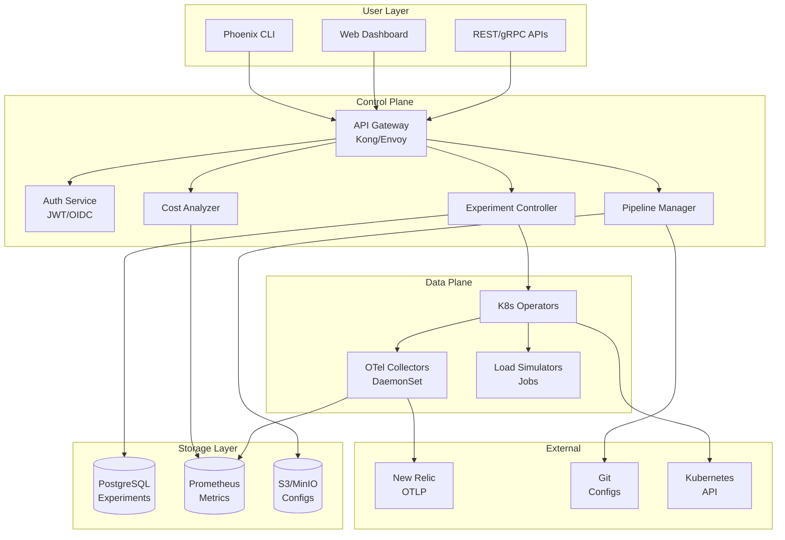

# Phoenix Platform - Master Technical Specification

**Document ID:** PHX-TECH-MASTER-001  
**Version:** 1.0.0  
**Status:** Authoritative  
**Last Updated:** 2024-05-24  
**Approval:** Architecture Review Board

## Table of Contents

1. [Executive Summary](#1-executive-summary)
2. [System Architecture](#2-system-architecture)
3. [Technology Stack](#3-technology-stack)
4. [Mono-Repository Structure](#4-mono-repository-structure)
5. [Service Specifications](#5-service-specifications)
6. [Data Architecture](#6-data-architecture)
7. [API Specifications](#7-api-specifications)
8. [Security Architecture](#8-security-architecture)
9. [Performance Requirements](#9-performance-requirements)
10. [Development Standards](#10-development-standards)
11. [Static Analysis Rules](#11-static-analysis-rules)
12. [Deployment Architecture](#12-deployment-architecture)

## 1. Executive Summary

### 1.1 Purpose

This master technical specification defines the authoritative architecture, standards, and implementation requirements for the Phoenix Observability Platform. All mono-repository implementations MUST conform to these specifications.

### 1.2 Scope

- **Platform Version:** MVP (Process Metrics Focus)
- **Architecture Pattern:** Microservices with Event-Driven Communication
- **Deployment Model:** Kubernetes-Native with VM Support
- **Repository Structure:** Mono-repo with enforced boundaries

### 1.3 Compliance Requirements

All code, configurations, and deployments MUST pass automated compliance checks defined in Section 11.

## 2. System Architecture

### 2.1 High-Level Architecture



### 2.2 Component Interaction Matrix

| Source Component | Target Component | Protocol | Auth Method | Data Format | Sync/Async |
|-----------------|------------------|----------|-------------|-------------|------------|
| CLI | API Gateway | HTTPS/gRPC | JWT | JSON/Protobuf | Sync |
| Web Dashboard | API Gateway | HTTPS/WSS | JWT | JSON | Sync/Async |
| API Gateway | Experiment Controller | gRPC | mTLS | Protobuf | Sync |
| Experiment Controller | PostgreSQL | TCP/5432 | Password | SQL | Sync |
| Experiment Controller | K8s Operators | gRPC | ServiceAccount | Protobuf | Async |
| Pipeline Manager | Git API | HTTPS | Token | JSON | Async |
| OTel Collectors | Prometheus | HTTP | None | OpenMetrics | Async |
| OTel Collectors | New Relic | HTTPS/gRPC | API Key | OTLP | Async |
| Cost Analyzer | Prometheus | HTTP | None | PromQL | Sync |

### 2.3 Service Boundaries

```yaml
service_boundaries:
  user_facing:
    - phoenix-cli
    - phoenix-dashboard
    - phoenix-api-gateway
    
  control_plane:
    - phoenix-auth-service
    - phoenix-experiment-controller
    - phoenix-pipeline-manager
    - phoenix-cost-analyzer
    
  data_plane:
    - phoenix-pipeline-operator
    - phoenix-loadsim-operator
    - phoenix-otel-collectors
    - phoenix-load-simulator
    
  shared_libraries:
    - phoenix-common-go
    - phoenix-common-js
    - phoenix-proto
```

## 3. Technology Stack

### 3.1 Core Technologies

| Component | Technology | Version | Justification |
|-----------|------------|---------|---------------|
| Backend Services | Go | 1.21+ | Performance, K8s ecosystem |
| Web Dashboard | React | 18+ | Component ecosystem, performance |
| CLI | Go + Cobra | Latest | Cross-platform, single binary |
| API Gateway | Kong | 3.4+ | Plugin ecosystem, performance |
| Service Mesh | None (MVP) | - | Reduce complexity |
| Container Runtime | containerd | 1.7+ | K8s standard |
| Orchestration | Kubernetes | 1.28+ | Industry standard |
| CI/CD | GitHub Actions | - | Integrated with repo |
| IaC | Terraform | 1.5+ | Multi-cloud support |

### 3.2 Data Technologies

| Purpose | Technology | Version | Justification |
|---------|------------|---------|---------------|
| Relational DB | PostgreSQL | 15+ | ACID, JSON support |
| Time Series DB | Prometheus | 2.45+ | K8s native, PromQL |
| Object Storage | S3/MinIO | Latest | Config versioning |
| Cache | Redis | 7+ | Performance |
| Message Queue | NATS | 2.10+ | Simplicity, performance |

### 3.3 Observability Stack

| Component | Technology | Version | Purpose |
|-----------|------------|---------|---------|
| Metrics Collection | OpenTelemetry | 0.88+ | Vendor neutral |
| Metrics Storage | Prometheus | 2.45+ | Local analysis |
| Metrics Export | OTLP | Latest | New Relic integration |
| Dashboards | Grafana | 10+ | Visualization |
| Logging | Structured JSON | - | Machine parseable |
| Tracing | OpenTelemetry | 0.88+ | Distributed tracing |

## 4. Mono-Repository Structure

### 4.1 Repository Layout

```
phoenix-platform/
├── .github/                      # GitHub specific configs
│   ├── workflows/               # CI/CD workflows
│   ├── CODEOWNERS              # Code ownership
│   └── dependabot.yml          # Dependency updates
├── build/                       # Build artifacts (git-ignored)
├── cmd/                         # Application entrypoints
│   ├── api/                    # API server
│   ├── cli/                    # CLI tool
│   ├── controller/             # Experiment controller
│   └── simulator/              # Load simulator
├── configs/                     # Configuration files
│   ├── base/                   # Base configurations
│   ├── overlays/               # Environment overlays
│   └── samples/                # Example configs
├── dashboard/                   # React web dashboard
│   ├── public/                 # Static assets
│   ├── src/                    # Source code
│   └── package.json           # Node dependencies
├── deployments/                 # Deployment configurations
│   ├── docker/                 # Dockerfiles
│   ├── helm/                   # Helm charts
│   ├── k8s/                    # Raw K8s manifests
│   └── terraform/              # IaC definitions
├── docs/                        # Documentation
│   ├── api/                    # API documentation
│   ├── architecture/           # Architecture docs
│   └── guides/                 # User guides
├── hack/                        # Development scripts
│   ├── boilerplate/            # Code templates
│   └── tools/                  # Build tools
├── internal/                    # Private application code
│   ├── api/                    # API implementations
│   ├── auth/                   # Authentication
│   ├── config/                 # Configuration
│   ├── controller/             # Controllers
│   └── store/                  # Data stores
├── operators/                   # Kubernetes operators
│   ├── pipeline/               # Pipeline operator
│   └── loadsim/               # Load sim operator
├── pkg/                         # Public libraries
│   ├── client/                 # Client libraries
│   ├── metrics/                # Metrics utilities
│   └── utils/                  # Common utilities
├── pipelines/                   # Pipeline definitions
│   ├── catalog/                # Pipeline catalog
│   └── templates/              # Pipeline templates
├── proto/                       # Protocol buffer definitions
├── scripts/                     # Operational scripts
├── test/                        # Test files
│   ├── e2e/                    # End-to-end tests
│   ├── integration/            # Integration tests
│   └── testdata/               # Test data
├── tools/                       # Go tools (go.mod)
├── vendor/                      # Vendored dependencies
├── .dockerignore               # Docker ignore rules
├── .gitignore                  # Git ignore rules
├── CLAUDE.md                   # AI assistant guide
├── CODE_OF_CONDUCT.md          # Community standards
├── CONTRIBUTING.md             # Contribution guide
├── go.mod                      # Go module definition
├── go.sum                      # Go module checksums
├── LICENSE                     # License file
├── Makefile                    # Build automation
├── README.md                   # Project overview
└── SECURITY.md                 # Security policy
```

### 4.2 Directory Standards

#### 4.2.1 Mandatory Directories

Every service MUST have:

```yaml
service_structure:
  required:
    - cmd/{service}/          # Main entry point
    - internal/{service}/     # Private implementation
    - pkg/{service}/          # Public APIs/clients
    - deployments/docker/{service}/  # Dockerfile
    - deployments/k8s/{service}/     # K8s manifests
    - docs/{service}/         # Service documentation
    - test/{service}/         # Service tests
```

#### 4.2.2 Forbidden Patterns

```yaml
forbidden:
  - "**/node_modules/"       # Must be git-ignored
  - "**/.env"               # No secrets in repo
  - "**/vendor/"            # Vendor folder controversial
  - "**/*.exe"              # No binaries
  - "**/*.key"              # No private keys
  - "**/temp/"              # No temporary files
```

## 5. Service Specifications

### 5.1 Phoenix API Service

```yaml
service:
  name: phoenix-api
  type: backend
  language: go
  
  endpoints:
    grpc:
      port: 5050
      services:
        - ExperimentService
        - PipelineService
        - MetricsService
    http:
      port: 8080
      base_path: /api/v1
      
  dependencies:
    - postgres: experiments
    - redis: cache
    - prometheus: metrics
    
  resources:
    requests:
      cpu: 100m
      memory: 256Mi
    limits:
      cpu: 1000m
      memory: 1Gi
      
  scaling:
    min_replicas: 2
    max_replicas: 10
    target_cpu: 70
    target_memory: 80
```

### 5.2 Phoenix Dashboard

```yaml
service:
  name: phoenix-dashboard
  type: frontend
  framework: react
  
  build:
    node_version: 18
    build_command: npm run build
    output_dir: dist
    
  features:
    - visual_pipeline_builder
    - experiment_monitoring
    - cost_analysis
    - real_time_updates
    
  api_integration:
    base_url: ${PHOENIX_API_URL}
    websocket: ${PHOENIX_WS_URL}
    auth_provider: oidc
    
  performance:
    bundle_size_limit: 500KB
    lighthouse_score: 90
    first_contentful_paint: <2s
```

### 5.3 Experiment Controller

```yaml
service:
  name: phoenix-experiment-controller
  type: controller
  pattern: reconciliation
  
  crds:
    - Experiment
    - PhoenixProcessPipeline
    - LoadSimulationJob
    
  reconciliation:
    interval: 30s
    error_backoff: exponential
    max_retries: 5
    
  state_machine:
    states:
      - pending
      - generating
      - deploying
      - running
      - analyzing
      - completed
      - failed
      
  webhooks:
    validating:
      - experiments.phoenix.io
    mutating:
      - experiments.phoenix.io
```

## 6. Data Architecture

### 6.1 Data Models

#### 6.1.1 Experiment Model

```sql
-- Core experiment table
CREATE TABLE experiments (
    id UUID PRIMARY KEY DEFAULT gen_random_uuid(),
    name VARCHAR(255) NOT NULL,
    description TEXT,
    owner_id UUID NOT NULL REFERENCES users(id),
    status VARCHAR(50) NOT NULL DEFAULT 'pending',
    spec JSONB NOT NULL,
    results JSONB,
    created_at TIMESTAMPTZ NOT NULL DEFAULT NOW(),
    updated_at TIMESTAMPTZ NOT NULL DEFAULT NOW(),
    started_at TIMESTAMPTZ,
    completed_at TIMESTAMPTZ,
    
    -- Indexes
    INDEX idx_experiments_owner (owner_id),
    INDEX idx_experiments_status (status),
    INDEX idx_experiments_created (created_at DESC)
);

-- Experiment variants
CREATE TABLE experiment_variants (
    id UUID PRIMARY KEY DEFAULT gen_random_uuid(),
    experiment_id UUID NOT NULL REFERENCES experiments(id) ON DELETE CASCADE,
    name VARCHAR(50) NOT NULL,
    pipeline_config JSONB NOT NULL,
    metrics JSONB,
    
    -- Constraints
    UNIQUE(experiment_id, name)
);

-- Experiment events for audit
CREATE TABLE experiment_events (
    id BIGSERIAL PRIMARY KEY,
    experiment_id UUID NOT NULL REFERENCES experiments(id) ON DELETE CASCADE,
    event_type VARCHAR(50) NOT NULL,
    event_data JSONB,
    created_at TIMESTAMPTZ NOT NULL DEFAULT NOW(),
    created_by UUID REFERENCES users(id),
    
    -- Partitioning by month
    -- Partition key included in PK
) PARTITION BY RANGE (created_at);
```

#### 6.1.2 Pipeline Catalog Model

```sql
-- Pipeline templates
CREATE TABLE pipeline_templates (
    id UUID PRIMARY KEY DEFAULT gen_random_uuid(),
    name VARCHAR(255) NOT NULL UNIQUE,
    version VARCHAR(50) NOT NULL,
    description TEXT,
    category VARCHAR(50) NOT NULL,
    config JSONB NOT NULL,
    metadata JSONB,
    is_active BOOLEAN DEFAULT true,
    created_at TIMESTAMPTZ NOT NULL DEFAULT NOW(),
    updated_at TIMESTAMPTZ NOT NULL DEFAULT NOW(),
    
    -- Version tracking
    UNIQUE(name, version),
    INDEX idx_templates_category (category),
    INDEX idx_templates_active (is_active)
);

-- Pipeline deployments
CREATE TABLE pipeline_deployments (
    id UUID PRIMARY KEY DEFAULT gen_random_uuid(),
    template_id UUID REFERENCES pipeline_templates(id),
    target_host VARCHAR(255) NOT NULL,
    target_type VARCHAR(50) NOT NULL, -- 'k8s_node', 'vm'
    status VARCHAR(50) NOT NULL DEFAULT 'deploying',
    config_override JSONB,
    deployed_at TIMESTAMPTZ,
    removed_at TIMESTAMPTZ,
    
    INDEX idx_deployments_host (target_host),
    INDEX idx_deployments_status (status)
);
```

### 6.2 Metrics Schema

```yaml
# Prometheus metrics exposed by Phoenix components

# Experiment metrics
phoenix_experiment_total{status="completed|failed|cancelled"} counter
phoenix_experiment_duration_seconds{status} histogram
phoenix_experiment_variants_count{experiment_id} gauge

# Pipeline metrics  
phoenix_pipeline_cardinality_reduction_ratio{pipeline,host} gauge
phoenix_pipeline_critical_processes_retained{pipeline,host} gauge
phoenix_pipeline_deployment_duration_seconds{pipeline} histogram

# Collector metrics
phoenix_collector_cpu_usage_cores{variant,host} gauge
phoenix_collector_memory_usage_bytes{variant,host} gauge
phoenix_collector_processing_duration_seconds{pipeline} histogram

# Cost metrics
phoenix_estimated_hourly_cost_usd{pipeline,host} gauge
phoenix_metrics_ingested_per_minute{pipeline,host} gauge
```

## 7. API Specifications

### 7.1 gRPC API Definitions

```protobuf
syntax = "proto3";
package phoenix.api.v1;

import "google/protobuf/timestamp.proto";
import "google/protobuf/duration.proto";
import "google/api/annotations.proto";

// ExperimentService manages A/B testing experiments
service ExperimentService {
  // Create a new experiment
  rpc CreateExperiment(CreateExperimentRequest) returns (Experiment) {
    option (google.api.http) = {
      post: "/v1/experiments"
      body: "*"
    };
  }
  
  // Get experiment by ID
  rpc GetExperiment(GetExperimentRequest) returns (Experiment) {
    option (google.api.http) = {
      get: "/v1/experiments/{experiment_id}"
    };
  }
  
  // List experiments with filtering
  rpc ListExperiments(ListExperimentsRequest) returns (ListExperimentsResponse) {
    option (google.api.http) = {
      get: "/v1/experiments"
    };
  }
  
  // Start experiment execution
  rpc StartExperiment(StartExperimentRequest) returns (Experiment) {
    option (google.api.http) = {
      post: "/v1/experiments/{experiment_id}/start"
    };
  }
  
  // Stream real-time experiment updates
  rpc StreamExperimentUpdates(StreamUpdatesRequest) returns (stream ExperimentUpdate);
}

message Experiment {
  string id = 1;
  string name = 2;
  string description = 3;
  string owner_id = 4;
  ExperimentSpec spec = 5;
  ExperimentStatus status = 6;
  ExperimentResults results = 7;
  google.protobuf.Timestamp created_at = 8;
  google.protobuf.Timestamp updated_at = 9;
}

message ExperimentSpec {
  string target_host = 1;
  google.protobuf.Duration duration = 2;
  repeated PipelineVariant variants = 3;
  LoadProfile load_profile = 4;
  repeated string critical_processes = 5;
  SuccessCriteria success_criteria = 6;
}
```

### 7.2 REST API Standards

```yaml
api_standards:
  versioning:
    strategy: url_path  # /api/v1/
    header: X-API-Version
    
  pagination:
    style: cursor_based
    params:
      - limit: max 100
      - cursor: opaque string
      
  filtering:
    style: query_params
    operators:
      - eq: equals
      - ne: not equals
      - gt: greater than
      - lt: less than
      - in: in list
      - like: pattern match
      
  sorting:
    param: sort
    format: field:asc|desc
    
  response_format:
    success:
      data: object
      meta:
        request_id: string
        timestamp: iso8601
    error:
      error:
        code: string
        message: string
        details: object
```

### 7.3 WebSocket Events

```typescript
// WebSocket event definitions
enum EventType {
  // Experiment events
  EXPERIMENT_CREATED = "experiment.created",
  EXPERIMENT_STARTED = "experiment.started", 
  EXPERIMENT_UPDATED = "experiment.updated",
  EXPERIMENT_COMPLETED = "experiment.completed",
  EXPERIMENT_FAILED = "experiment.failed",
  
  // Metrics events
  METRICS_UPDATE = "metrics.update",
  COST_UPDATE = "cost.update",
  
  // System events
  COLLECTOR_STATUS = "collector.status",
  PIPELINE_DEPLOYED = "pipeline.deployed"
}

interface WebSocketMessage<T = any> {
  id: string;
  type: EventType;
  timestamp: string;
  data: T;
  metadata?: Record<string, any>;
}

// Example experiment update event
interface ExperimentUpdateData {
  experimentId: string;
  variantMetrics: {
    [variantName: string]: {
      inputProcessCount: number;
      outputSeriesCount: number;
      cardinalityReduction: number;
      criticalProcessesRetained: number;
      collectorCpuUsage: number;
      collectorMemoryUsage: number;
    }
  };
}
```

## 8. Security Architecture

### 8.1 Authentication & Authorization

```yaml
authentication:
  primary: jwt
  providers:
    - internal: username/password
    - oidc: 
        providers:
          - google
          - github
          - okta
  token:
    algorithm: RS256
    expiry: 1h
    refresh_expiry: 7d
    
authorization:
  model: rbac
  roles:
    - viewer: read-only access
    - operator: deploy pipelines
    - experimenter: run experiments
    - admin: full access
    
  resources:
    - experiments
    - pipelines
    - deployments
    - metrics
    - costs
    
  permissions:
    - experiments:read
    - experiments:create
    - experiments:update
    - experiments:delete
    - pipelines:read
    - pipelines:deploy
    - metrics:read
    - costs:read
```

### 8.2 Network Security

```yaml
network_policies:
  ingress:
    - name: allow-dashboard
      from: 
        - namespaceSelector:
            matchLabels:
              name: ingress-nginx
      ports:
        - 80
        - 443
        
    - name: allow-api
      from:
        - podSelector:
            matchLabels:
              app: phoenix-dashboard
      ports:
        - 8080
        - 5050
        
  egress:
    - name: allow-newrelic
      to:
        - external:
            - otlp.nr-data.net
      ports:
        - 443
        
    - name: allow-dns
      to:
        - namespaceSelector: {}
      ports:
        - 53
```

### 8.3 Secrets Management

```yaml
secrets:
  provider: kubernetes
  encryption: 
    method: envelope
    kms: aws-kms
    
  types:
    - api_keys:
        rotation: 90d
        format: alphanumeric
        length: 32
        
    - certificates:
        rotation: 365d
        issuer: letsencrypt
        
    - database:
        rotation: 30d
        format: complex
        length: 24
        
  storage:
    - kubernetes: default
    - vault: optional
    - aws_secrets_manager: optional
```

## 9. Performance Requirements

### 9.1 Service Level Objectives

| Service | Metric | SLO | Measurement |
|---------|--------|-----|-------------|
| API Gateway | Latency (p99) | <100ms | Prometheus histogram |
| API Gateway | Availability | 99.9% | Uptime checks |
| Experiment Controller | Reconciliation Lag | <30s | Custom metric |
| Dashboard | Page Load Time | <2s | Lighthouse |
| OTel Collector | CPU Usage | <5% | cAdvisor |
| OTel Collector | Memory Usage | <256MB | cAdvisor |
| Pipeline Deployment | Time to Ready | <5min | Custom metric |

### 9.2 Scalability Targets

```yaml
scalability:
  concurrent_experiments: 100
  collectors_per_host: 2  # For A/B testing
  total_hosts: 1000
  metrics_per_second: 1_000_000
  api_requests_per_second: 1000
  websocket_connections: 10_000
  
resource_limits:
  control_plane:
    total_cpu: 8 cores
    total_memory: 16GB
    
  per_collector:
    cpu: 0.5 cores
    memory: 512MB
    
  database:
    connections: 100
    storage: 100GB
```

### 9.3 Benchmark Requirements

```go
// Required benchmarks for critical paths
package benchmarks

// Pipeline deployment must complete in <5s
func BenchmarkPipelineDeployment(b *testing.B) {
    // Target: <5s for full deployment
}

// Metric processing must handle 10k metrics/sec
func BenchmarkMetricProcessing(b *testing.B) {
    // Target: 10,000 metrics/second per collector
}

// API response time must be <50ms (p95)
func BenchmarkAPIResponse(b *testing.B) {
    // Target: p95 < 50ms
}
```

## 10. Development Standards

### 10.1 Code Standards

#### 10.1.1 Go Standards

```yaml
go_standards:
  version: "1.21"
  style_guide: "effective_go"
  
  project_layout:
    - cmd/: application entrypoints
    - internal/: private code
    - pkg/: public libraries
    - api/: API definitions
    
  linting:
    tool: golangci-lint
    config: .golangci.yml
    rules:
      - gofmt
      - goimports
      - golint
      - govet
      - ineffassign
      - misspell
      
  testing:
    coverage_threshold: 80%
    tools:
      - testing: standard
      - testify: assertions
      - gomock: mocking
      
  dependencies:
    management: go_modules
    vendoring: optional
    private_repos: git_config
```

#### 10.1.2 JavaScript/TypeScript Standards

```yaml
javascript_standards:
  version: "ES2022"
  typescript: "5.0+"
  
  style_guide:
    base: airbnb
    overrides:
      - semicolons: required
      - quotes: single
      - indent: 2_spaces
      
  framework:
    react: "18+"
    state: redux_toolkit
    routing: react_router
    ui: material_ui
    
  linting:
    eslint: 
      extends:
        - airbnb
        - airbnb-typescript
      plugins:
        - react-hooks
        - jsx-a11y
        
  testing:
    framework: jest
    coverage_threshold: 80%
    e2e: playwright
```

### 10.2 Git Standards

```yaml
git_standards:
  branching:
    model: github_flow
    branches:
      - main: production ready
      - feature/*: new features
      - fix/*: bug fixes
      - docs/*: documentation
      
  commits:
    format: conventional
    types:
      - feat: new feature
      - fix: bug fix
      - docs: documentation
      - style: formatting
      - refactor: code restructuring
      - test: tests
      - chore: maintenance
      
  pull_requests:
    required_checks:
      - ci/build
      - ci/test
      - ci/lint
      - ci/security
    required_reviews: 2
    dismiss_stale_reviews: true
```

### 10.3 Documentation Standards

```yaml
documentation:
  code:
    go:
      - package: godoc format
      - functions: describe purpose
      - types: describe usage
    typescript:
      - components: jsdoc
      - functions: tsdoc
      - types: inline
      
  api:
    format: openapi_3.0
    tools:
      - swagger_ui
      - redoc
      
  architecture:
    format: markdown
    diagrams: mermaid
    decisions: adr
    
  user:
    format: markdown
    hosting: mkdocs
    versioning: git_tags
```

## 11. Static Analysis Rules

### 11.1 Folder Structure Validation

```yaml
# .phoenix-structure.yaml
version: 1.0
rules:
  required_files:
    - path: /
      files:
        - README.md
        - LICENSE
        - Makefile
        - go.mod
        - .gitignore
        
  required_directories:
    - path: /
      directories:
        - cmd/
        - internal/
        - pkg/
        - docs/
        - test/
        
  service_structure:
    pattern: "cmd/*"
    requires:
      - internal/${service}/
      - pkg/${service}/client/
      - deployments/docker/${service}/
      - docs/${service}/
      
  naming_conventions:
    - pattern: "*.go"
      rules:
        - snake_case: false
        - camelCase: true
        
    - pattern: "*.proto"
      rules:
        - snake_case: true
        
  size_limits:
    - pattern: "*.go"
      max_lines: 500
      
    - pattern: "internal/**/handler.go"
      max_lines: 200
      
  forbidden_imports:
    - pattern: "pkg/**"
      forbidden:
        - "*/internal/*"
        
    - pattern: "cmd/**"
      forbidden:
        - "github.com/phoenix/platform/cmd/*"
```

### 11.2 Automated Enforcement

```go
// tools/structure-validator/main.go
package main

import (
    "fmt"
    "os"
    "path/filepath"
    "gopkg.in/yaml.v3"
)

type StructureConfig struct {
    Version string `yaml:"version"`
    Rules   Rules  `yaml:"rules"`
}

type Rules struct {
    RequiredFiles       []RequiredFile      `yaml:"required_files"`
    RequiredDirectories []RequiredDirectory `yaml:"required_directories"`
    ServiceStructure    ServiceStructure    `yaml:"service_structure"`
    NamingConventions   []NamingConvention  `yaml:"naming_conventions"`
    SizeLimits         []SizeLimit         `yaml:"size_limits"`
    ForbiddenImports   []ForbiddenImport   `yaml:"forbidden_imports"`
}

func main() {
    // Load configuration
    config, err := loadConfig(".phoenix-structure.yaml")
    if err != nil {
        fmt.Fprintf(os.Stderr, "Failed to load config: %v\n", err)
        os.Exit(1)
    }
    
    // Run validations
    var errors []error
    
    errors = append(errors, validateRequiredFiles(config.Rules.RequiredFiles)...)
    errors = append(errors, validateRequiredDirectories(config.Rules.RequiredDirectories)...)
    errors = append(errors, validateServiceStructure(config.Rules.ServiceStructure)...)
    errors = append(errors, validateNamingConventions(config.Rules.NamingConventions)...)
    errors = append(errors, validateSizeLimits(config.Rules.SizeLimits)...)
    errors = append(errors, validateImports(config.Rules.ForbiddenImports)...)
    
    // Report results
    if len(errors) > 0 {
        fmt.Fprintf(os.Stderr, "Structure validation failed with %d errors:\n", len(errors))
        for _, err := range errors {
            fmt.Fprintf(os.Stderr, "  - %v\n", err)
        }
        os.Exit(1)
    }
    
    fmt.Println("✓ Structure validation passed")
}
```

### 11.3 CI/CD Integration

```yaml
# .github/workflows/structure-check.yml
name: Structure Validation

on:
  pull_request:
    branches: [main]
  push:
    branches: [main]

jobs:
  validate-structure:
    runs-on: ubuntu-latest
    steps:
      - uses: actions/checkout@v3
      
      - name: Setup Go
        uses: actions/setup-go@v4
        with:
          go-version: '1.21'
          
      - name: Install structure validator
        run: go install ./tools/structure-validator
        
      - name: Validate repository structure
        run: structure-validator
        
      - name: Check file permissions
        run: |
          # Ensure scripts are executable
          find scripts -name "*.sh" -type f ! -perm -u+x -print -exit 1
          
      - name: Validate go.mod consistency
        run: |
          go mod tidy
          git diff --exit-code go.mod go.sum
          
      - name: Check generated code
        run: |
          make generate
          git diff --exit-code
```

## 12. Deployment Architecture

### 12.1 Kubernetes Deployment

```yaml
deployment_strategy:
  environments:
    - development:
        cluster: kind/minikube
        namespace: phoenix-dev
        replicas: 1
        
    - staging:
        cluster: eks-staging
        namespace: phoenix-staging
        replicas: 2
        
    - production:
        cluster: eks-production
        namespace: phoenix-prod
        replicas: 3
        regions:
          - us-east-1
          - eu-west-1
          
  rollout:
    strategy: rolling_update
    max_surge: 1
    max_unavailable: 0
    
  health_checks:
    liveness:
      path: /healthz
      period: 10s
      threshold: 3
      
    readiness:
      path: /ready
      period: 5s
      threshold: 1
      
  resource_quotas:
    cpu: 100
    memory: 200Gi
    pods: 1000
    services: 100
```

### 12.2 GitOps Configuration

```yaml
gitops:
  tool: argocd
  repo: github.com/phoenix/platform-configs
  
  applications:
    - name: phoenix-control-plane
      path: deployments/k8s/control-plane
      destination: phoenix-system
      sync_policy:
        automated:
          prune: true
          self_heal: true
          
    - name: phoenix-collectors
      path: deployments/k8s/collectors
      destination: phoenix-collectors
      sync_policy:
        automated:
          prune: false  # Don't auto-remove collectors
          self_heal: true
          
  secrets:
    provider: sealed-secrets
    encryption: rsa-2048
```

### 12.3 Multi-Tenancy

```yaml
multi_tenancy:
  isolation: namespace
  
  tenant_resources:
    - namespace
    - resource_quota
    - network_policy
    - rbac
    
  shared_resources:
    - control_plane
    - prometheus
    - grafana
    
  limits_per_tenant:
    experiments: 10
    pipelines: 50
    collectors: 100
```

---

## Appendices

### Appendix A: Compliance Matrix

| Requirement | Standard | Implementation | Validation |
|-------------|----------|----------------|------------|
| Data Privacy | GDPR | No PII in metrics | Automated scanning |
| Security | SOC2 | Encryption at rest/transit | Penetration testing |
| Availability | 99.9% SLA | Multi-region deployment | Synthetic monitoring |
| Performance | <100ms p99 | Caching, optimization | Load testing |

### Appendix B: Technology Decisions

| Decision | Options Considered | Selected | Rationale |
|----------|-------------------|----------|-----------|
| Language | Go, Rust, Java | Go | K8s ecosystem, performance |
| Frontend | React, Vue, Angular | React | Ecosystem, performance |
| Database | PostgreSQL, MySQL | PostgreSQL | Features, extensions |
| Metrics | Prometheus, InfluxDB | Prometheus | K8s native |

### Appendix C: Migration Path

For existing systems:
1. Deploy Phoenix alongside current monitoring
2. Mirror subset of metrics to Phoenix
3. Validate cost reduction on subset
4. Gradually migrate remaining hosts
5. Decommission legacy monitoring

---

**Document Control:**
- Next Review: 2024-08-24
- Change Process: Architecture Review Board approval required
- Distribution: Engineering Teams, SRE, Product Management